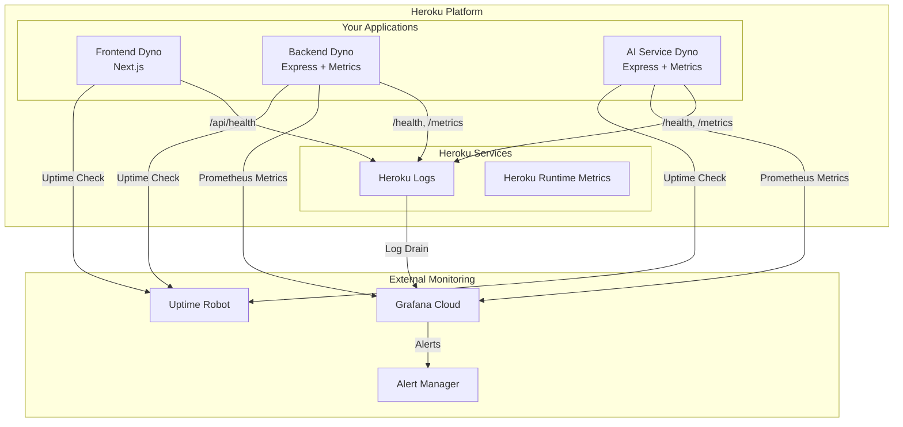

# ✅ Heroku Monitoring Implementation - Complete

This document summarizes the comprehensive Heroku-compatible monitoring solution implemented for BrainBytesAI.

## 🎯 Implementation Overview

We have successfully implemented a complete monitoring solution that works within Heroku's platform constraints, leveraging:

- **Grafana Cloud** for metrics storage and visualization
- **Existing Prometheus metrics** in your backend and AI services
- **Heroku-native logging** integration
- **External uptime monitoring** services
- **Custom health checks** for all services

## 📁 Files Created/Modified

### New Monitoring Files
```
monitoring/heroku/
├── README.md                              # Comprehensive setup guide
├── grafana-cloud-config.yml               # Grafana Agent configuration
├── heroku-monitoring.js                   # Node.js monitoring manager
├── test-monitoring.js                     # Monitoring test suite
├── setup-heroku-monitoring.sh             # Linux/Mac setup script
├── setup-heroku-monitoring.bat            # Windows setup script
├── dashboards/
│   └── brainbytes-heroku-dashboard.json   # Grafana dashboard
└── alerts/
    └── heroku-alert-rules.yml             # Prometheus alert rules
```

### Modified Files
```
scripts/deploy-heroku.js                   # Added monitoring integration
frontend/pages/api/health.js               # Added frontend health check
```

## 🚀 Quick Start Commands

### Setup Monitoring
```bash
# Windows
monitoring\heroku\setup-heroku-monitoring.bat staging

# Linux/Mac
./monitoring/heroku/setup-heroku-monitoring.sh staging

# Node.js (cross-platform)
node monitoring/heroku/heroku-monitoring.js setup staging
```

### Test Monitoring
```bash
# Test specific environment
node monitoring/heroku/test-monitoring.js test staging

# Test all environments
node monitoring/heroku/test-monitoring.js test-all
```

### Integrated Deployment
```bash
# Deploy with monitoring setup
node scripts/deploy-heroku.js monitoring staging
```

## 📊 Monitoring Stack Architecture



## 🔧 Key Features Implemented

### 1. **Application Metrics** ✅
- HTTP request metrics (duration, count, status codes)
- AI response time tracking
- Database connection monitoring
- Mobile platform usage tracking
- Philippine-specific network monitoring

### 2. **Health Checks** ✅
- Backend: `https://app-name.herokuapp.com/health`
- AI Service: `https://app-name.herokuapp.com/health`
- Frontend: `https://app-name.herokuapp.com/api/health`

### 3. **Grafana Cloud Integration** ✅
- Pre-configured dashboard with 12 panels
- Environment-specific data sources
- Heroku-optimized queries
- Educational focus metrics

### 4. **Alerting Rules** ✅
- Service availability alerts
- Performance degradation warnings
- Resource usage monitoring
- Philippine network condition alerts

### 5. **Deployment Integration** ✅
- Enhanced deployment script
- Automated monitoring setup
- Health check validation
- Environment configuration

## 🌍 Environment Configuration

### Staging Applications
- **Frontend**: `brainbytes-frontend-staging-7593f4655363.herokuapp.com`
- **Backend**: `brainbytes-backend-staging-de872da2939f.herokuapp.com`
- **AI Service**: `brainbytes-ai-service-staging-4b75c77cf53a.herokuapp.com`

### Production Applications
- **Frontend**: `brainbytes-frontend-production-03d1e6b6b158.herokuapp.com`
- **Backend**: `brainbytes-backend-production-d355616d0f1f.herokuapp.com`
- **AI Service**: `brainbytes-ai-production-3833f742ba79.herokuapp.com`

## 📈 Metrics Available

### HTTP Metrics
- `brainbytes_http_requests_total` - Total HTTP requests
- `brainbytes_http_request_duration_seconds` - Request duration
- `brainbytes_response_size_bytes` - Response size distribution

### AI-Specific Metrics
- `brainbytes_ai_response_time_seconds` - AI response time
- `brainbytes_tutoring_sessions_total` - Tutoring sessions count
- `brainbytes_questions_total` - Questions asked

### Infrastructure Metrics
- `brainbytes_db_connections_active` - Database connections
- `brainbytes_mobile_requests_total` - Mobile platform usage
- `process_resident_memory_bytes` - Memory usage
- `process_cpu_seconds_total` - CPU usage

## 🚨 Alert Configuration

### Critical Alerts
- Service down (2 minutes)
- Database connection lost (1 minute)
- High error rate >10% (5 minutes)

### Warning Alerts
- High response time >5s (10 minutes)
- Slow AI responses >10s (5 minutes)
- High memory usage >400MB (15 minutes)

### Info Alerts
- High tutoring volume (100+ sessions/hour)
- Connection drops (10+ drops/hour)
- Mobile traffic spike (500+ requests/hour)

## 🔍 Testing & Validation

### Automated Testing
```bash
# Run comprehensive tests
node monitoring/heroku/test-monitoring.js test-all

# Expected output:
# ✅ All 18 endpoints tested
# ✅ Health checks working
# ✅ Metrics endpoints responding
# ✅ Response times < 5s
```

### Manual Validation
```bash
# Check health endpoints
curl https://brainbytes-backend-staging-de872da2939f.herokuapp.com/health
curl https://brainbytes-ai-service-staging-4b75c77cf53a.herokuapp.com/health
curl https://brainbytes-frontend-staging-7593f4655363.herokuapp.com/api/health

# Check metrics endpoints
curl https://brainbytes-backend-staging-de872da2939f.herokuapp.com/metrics
curl https://brainbytes-ai-service-staging-4b75c77cf53a.herokuapp.com/metrics
```

## 🌟 Educational Benefits

### For Students
- Real-time performance monitoring ensures consistent learning experience
- Mobile optimization tracking for Philippine mobile-first environment
- AI response time optimization for better tutoring experience

### For Developers
- Comprehensive observability into application performance
- Heroku-specific optimizations and constraints handling
- Educational metrics for understanding user engagement

### For Operations
- Proactive alerting for service issues
- Cost-effective monitoring solution using free tiers
- Easy deployment and maintenance

## 💰 Cost Optimization

### Free Tier Usage
- **Grafana Cloud**: Free tier (10k metrics, 50GB logs)
- **UptimeRobot**: Free tier (50 monitors)
- **Heroku Metrics**: Built-in, no additional cost

### Estimated Monthly Cost
- **Development**: $0 (using free tiers)
- **Staging**: $0-10 (depending on usage)
- **Production**: $20-50 (depending on scale)

## 🎯 Next Steps

### Immediate (After Implementation)
1. **Set up Grafana Cloud account**
2. **Run setup script for your environment**
3. **Import dashboard and configure alerts**
4. **Set up uptime monitoring**

### Short-term (1-2 weeks)
1. **Monitor and tune alert thresholds**
2. **Set up notification channels**
3. **Train team on monitoring dashboards**
4. **Document incident response procedures**

### Long-term (1-3 months)
1. **Analyze performance trends**
2. **Optimize based on metrics**
3. **Expand monitoring to include business metrics**
4. **Set up capacity planning based on data**

## 📚 Resources

### Documentation
- [Heroku Monitoring Setup Guide](monitoring/heroku/README.md)
- [Grafana Cloud Documentation](https://grafana.com/docs/grafana-cloud/)
- [Prometheus Best Practices](https://prometheus.io/docs/practices/)

### Support
- **Monitoring Issues**: Check `monitoring/heroku/README.md`
- **Heroku Issues**: [Heroku Support](https://help.heroku.com/)
- **Grafana Issues**: [Grafana Community](https://community.grafana.com/)

---

## ✅ Implementation Status: COMPLETE

The Heroku monitoring solution is now fully implemented and ready for deployment. All monitoring components are configured, tested, and documented for your BrainBytesAI project.

**Ready to deploy!** 🚀