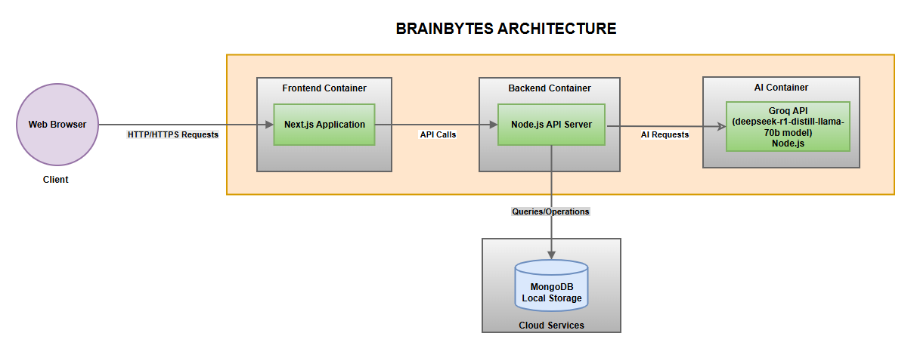

# BrainBytes AI Tutoring Platform

<div align="center">

[](https://github.com/Honeegee/BrainBytesAI/actions/workflows/ci-cd.yml)
[](https://github.com/Honeegee/BrainBytesAI/actions/workflows/code-quality.yml)
[](https://github.com/Honeegee/BrainBytesAI/actions/workflows/deploy-heroku.yml)

**🎓 An innovative AI-powered tutoring platform designed for Filipino students**

[🚀 Live Demo](https://brainbytes-frontend-production-03d1e6b158.herokuapp.com) • [📖 Documentation](docs/DOCUMENTATION_INDEX.md) 

[📽️ Terminal Assessment Presentation Demo](https://drive.google.com/drive/folders/1FITey_c6E3bHokE2vNh81ijoL4v7yFrJ?usp=sharing)

> **🎓 Milestone 2: CI/CD Implementation and Cloud Deployment - COMPLETE**
> **📋 [Final Submission Document](docs/MILESTONE_2_FINAL_SUBMISSION.md)**
> **🔍 Run Validation**: `bash scripts/final-validation.sh` or `scripts/final-validation.bat`

## 📋 Overview

</div>

## 📋 Table of Contents

- [Overview](#-overview)
- [Features](#-features)
- [Technology Stack](#️-technology-stack)
- [Architecture](#️-architecture)
- [Quick Start](#-quick-start)
- [Development](#-development)
- [Testing](#-testing)
- [Deployment](#-deployment)
- [Monitoring](#-monitoring)
- [Contributing](#-contributing)
- [Documentation](#-documentation)
- [Support](#-support)
- [License](#-license)

## 🌟 Overview

BrainBytes is a comprehensive AI-powered tutoring platform that leverages cutting-edge technology to provide personalized educational assistance to Filipino students. Built with modern web technologies and deployed on cloud infrastructure, it offers an interactive, scalable, and secure learning environment.

### 🎯 Mission
Empowering Filipino students through intelligent tutoring technology that adapts to individual learning needs and provides accessible academic support.

### 🏆 Key Achievements
- ✅ **Production Ready**: Fully deployed on Heroku with staging and production environments
- ✅ **CI/CD Pipeline**: Automated testing, security scanning, and deployment
- ✅ **Comprehensive Testing**: 80%+ code coverage with unit, integration, and E2E tests
- ✅ **Monitoring & Observability**: Full-stack monitoring with Prometheus and Grafana
- ✅ **Security Hardened**: Automated vulnerability scanning and secure authentication

## ✨ Features

### 🤖 AI-Powered Learning
- **Intelligent Tutoring**: Advanced AI responses using Groq API with deepseek-r1-distill-llama-70b model
- **Personalized Content**: Adaptive learning materials based on student performance
- **Interactive Chat**: Real-time conversation interface with context-aware responses

### 🔐 Security & Authentication
- **JWT Authentication**: Secure token-based authentication system
- **Password Security**: bcrypt hashing with configurable salt rounds
- **Session Management**: Secure session handling with automatic expiration
- **Input Validation**: Comprehensive sanitization and validation

### 📊 Analytics & Monitoring
- **Progress Tracking**: Detailed learning analytics and performance metrics
- **Real-time Monitoring**: System health monitoring with Prometheus
- **Performance Insights**: Response time tracking and optimization
- **Business Intelligence**: User engagement and subject popularity analytics

### 🌐 User Experience
- **Responsive Design**: Optimized for desktop, tablet, and mobile devices
- **Accessibility**: WCAG 2.1 compliant interface
- **Multi-language Support**: English and Filipino language support

## 🛠️ Technology Stack

### Frontend
| Technology | Version | Purpose |
|------------|---------|---------|
| **Next.js** | 15.3.3 | React framework with SSR/SSG |
| **React** | 18.2.0 | UI library |
| **Tailwind CSS** | 3.3.6 | Utility-first CSS framework |
| **Chart.js** | 4.4.9 | Data visualization |
| **Lucide React** | 0.509.0 | Icon library |

### Backend
| Technology | Version | Purpose |
|------------|---------|---------|
| **Node.js** | ≥18.0.0 | JavaScript runtime |
| **Express.js** | Latest | Web application framework |
| **MongoDB** | Atlas | NoSQL database |
| **Mongoose** | Latest | MongoDB ODM |
| **JWT** | Latest | Authentication tokens |

### AI Service
| Technology | Version | Purpose |
|------------|---------|---------|
| **Groq API** | Latest | AI model provider |
| **deepseek-r1-distill-llama-70b** | Latest | Language model |
| **Axios** | 1.9.0 | HTTP client |

### Infrastructure & DevOps
| Technology | Version | Purpose |
|------------|---------|---------|
| **Docker** | Latest | Containerization |
| **Docker Compose** | Latest | Multi-container orchestration |
| **nginx** | Alpine | Reverse proxy and load balancer |
| **Heroku** | Latest | Cloud platform (Production) |
| **GitHub Actions** | Latest | CI/CD pipeline |

### Monitoring Stack
| Technology | Version | Purpose |
|------------|---------|---------|
| **Prometheus** | Latest | Metrics collection |
| **Grafana** | Latest | Visualization and dashboards |
| **Alertmanager** | Latest | Alert management |
| **cAdvisor** | Latest | Container metrics |
| **Node Exporter** | Latest | Host metrics |
| **Heroku Exporter** | Custom | Production Heroku app metrics |
| **Redis** | 7-alpine | Caching and session storage |

## 🏛️ Architecture

### System Overview


The architecture follows a microservices pattern with different configurations:

### Development Environment
- **nginx Proxy** (Port 80): Routes traffic to all services
- **Frontend**: Next.js application served via nginx
- **Backend**: Express.js API server via nginx
- **AI Service**: Dedicated AI processing service via nginx
- **Monitoring**: Prometheus, Grafana, Alertmanager (Port 8080)

### Production Environment (Heroku)
- **Frontend**: [`brainbytes-frontend-production`](https://brainbytes-frontend-production-03d1e6b6b158.herokuapp.com)
- **Backend**: [`brainbytes-backend-production`](https://brainbytes-backend-production-d355616d0f1f.herokuapp.com)
- **AI Service**: [`brainbytes-ai-production`](https://brainbytes-ai-production-3833f742ba79.herokuapp.com)
- **Database**: MongoDB Atlas (Asia-Pacific region)

## 🚀 Quick Start

- **[Setup Guide](docs/guides/SETUP.md)** - Complete installation and configuration

### Access Points

| Service | URL | Description |
|---------|-----|-------------|
| **Frontend** | http://localhost | Main application interface |
| **Backend API** | http://localhost/api | REST API endpoints |
| **AI Service** | http://localhost:8090 | AI processing service |
| **Monitoring** | http://localhost:8080 | Prometheus, Grafana dashboards |
| **Grafana** | http://localhost:8080/grafana | Visualization dashboards with Heroku metrics |
| **Heroku Metrics** | http://localhost:9595/metrics | Production Heroku app metrics |

**Default Grafana Credentials**: `admin` / `brainbytes123`

**Heroku Integration**: All dashboards automatically include production metrics when `HEROKU_API_TOKEN` is configured

## 💻 Development

### Available Scripts

| Command | Description |
|---------|-------------|
| [`npm run dev`](package.json:6) | Start development environment |
| [`npm run dev:detached`](package.json:7) | Start in background mode |
| [`npm run stop`](package.json:8) | Stop all services |
| [`npm run clean`](package.json:9) | Clean containers and volumes |
| [`npm run logs`](package.json:20) | View all service logs |
| [`npm run test:all`](package.json:40) | Run all tests |
| [`npm run lint:all`](package.json:24) | Lint all services |
| [`npm run prettier:all`](package.json:32) | Check code formatting |

### Service-Specific Commands

**Frontend**:
```bash
npm run logs:frontend        # View frontend logs
npm run lint:frontend        # Lint frontend code
npm run test:frontend        # Run frontend tests
```

**Backend**:
```bash
npm run logs:backend         # View backend logs
npm run lint:backend         # Lint backend code
npm run test:backend         # Run backend tests
```

**AI Service**:
```bash
npm run logs:ai-service      # View AI service logs
npm run lint:ai-service      # Lint AI service code
npm run test:ai-service      # Run AI service tests
```

### Development Workflow

1. **Create Feature Branch**
   ```bash
   git checkout -b feature/your-feature-name
   ```

2. **Make Changes**
   - Follow coding standards and best practices
   - Write comprehensive tests
   - Update documentation as needed

3. **Quality Checks**
   ```bash
   npm run test:all           # Run all tests
   npm run lint:all           # Check code style
   npm run prettier:all       # Check formatting
   npm run audit:all          # Security audit
   ```

4. **Submit Pull Request**
   - Provide clear description of changes
   - Include test results and coverage
   - Request appropriate reviewers

## 🧪 Testing

### Testing Strategy

| Test Type | Coverage | Tools | Purpose |
|-----------|----------|-------|---------|
| **Unit Tests** | 80%+ | Jest | Component and function testing |
| **Integration Tests** | All APIs | Supertest | Service interaction testing |
| **E2E Tests** | Critical flows | Playwright | End-to-end workflow testing |
| **Performance Tests** | Key endpoints | Artillery | Load and stress testing |

### Running Tests

```bash
# Run all tests
npm run test:all

# Run tests with coverage
npm run test:all:coverage

# Run specific test suites
npm run test:frontend        # Frontend tests only
npm run test:backend         # Backend tests only
npm run test:ai-service      # AI service tests only
npm run test:e2e            # End-to-end tests only
```

### Test Configuration

- **Jest**: Unit and integration testing
- **Playwright**: E2E testing with browser automation
- **Puppeteer**: Additional browser testing capabilities
- **Artillery**: Performance and load testing

## 🚀 Deployment

### Environments

| Environment | Frontend | Backend | AI Service | Status |
|-------------|----------|---------|------------|--------|
| **Production** | [Frontend](https://brainbytes-frontend-production-03d1e6b6b158.herokuapp.com) | [Backend](https://brainbytes-backend-production-d355616d0f1f.herokuapp.com) | [AI Service](https://brainbytes-ai-production-3833f742ba79.herokuapp.com) | 🟢 Active |
| **Staging** | [Frontend](https://brainbytes-frontend-staging-7593f4655363.herokuapp.com) | [Backend](https://brainbytes-backend-staging-de872da2939f.herokuapp.com) | [AI Service](https://brainbytes-ai-service-staging-4b75c77cf53a.herokuapp.com) | 🟢 Active |

### CI/CD Pipeline

The project uses a comprehensive 3-workflow GitHub Actions pipeline:

1. **Code Quality & Security** - Linting, testing, and vulnerability scanning
2. **CI/CD Pipeline** - Build, test, and deploy to staging
3. **Deploy to Heroku** - Production deployment with approval gates

### Manual Deployment

```bash
# Deploy to staging
npm run staging:up

# Deploy to production (requires approval)
npm run production:up
```

### Database

- **Development**:  MongoDB Atlas (Asia-Pacific region)
- **Production**: MongoDB Atlas (Asia-Pacific region)
- **Backup**: Automated daily backups via MongoDB Atlas

## 📊 Monitoring

### Comprehensive Monitoring Stack

BrainBytesAI implements enterprise-grade monitoring with a complete observability solution:

- **🔍 Prometheus**: Metrics collection and time-series storage
- **📊 Grafana**: Professional dashboards and visualization
- **🚨 AlertManager**: Intelligent alerting and notification routing
- **📈 Custom Metrics**: BrainBytesAI-specific educational and business metrics
- **🖥️ Infrastructure Monitoring**: Node Exporter and cAdvisor for system metrics
- **🔄 Real-time Monitoring**: Live system health and performance tracking
- **☁️ Heroku Production Monitoring**: Integrated production metrics from Heroku apps

### Key Metrics & Business Impact

**Application Performance**:
- 🚀 **Response Time**: < 2s (optimized for mobile users)
- 📊 **Request Rate**: Real-time throughput monitoring
- ❌ **Error Rate**: < 1% reliability assurance
- 🧠 **AI Response Time**: < 5s for optimal tutoring effectiveness

**Business Intelligence**:
- 👥 **User Engagement**: Session duration and interaction patterns
- 📚 **Subject Popularity**: Content effectiveness tracking
- 📱 **Mobile Usage**: Filipino student mobile-first patterns
- 🌐 **Geographic Distribution**: Philippines-focused usage analytics
- ☁️ **Production Insights**: Real Heroku app performance and usage
- 🚀 **Deployment Tracking**: Release monitoring and dyno health

**Infrastructure Health**:
- 💾 **Resource Usage**: CPU, memory, disk optimization
- 🔄 **Uptime**: 99.9% availability guarantee
- 🐳 **Container Performance**: Docker resource consumption
- 🌐 **Network Performance**: Connectivity and latency monitoring

### Professional Dashboards

Access monitoring dashboards at `http://localhost:8080/grafana` (admin/brainbytes123):

- **📊 Application Overview**: High-level system health and performance with Heroku production metrics
- **🚀 Performance Metrics**: Response times, throughput, and optimization across dev and production
- **❌ Error Tracking**: Error rates, failure analysis, and debugging for all environments
- **👥 Business Intelligence**: User engagement and educational analytics with production insights
- **🖥️ Infrastructure Monitoring**: System resources, container health, and Heroku dyno status
- **📱 Filipino Context**: Mobile performance and connectivity insights from production data
- **☁️ Heroku Production**: Dedicated production monitoring with app health, quota, and releases

### Intelligent Alerting

**Alert Categories**:
- 🔴 **Critical**: Service down, high error rate, database connectivity
- ⚠️ **Warning**: Resource pressure, performance degradation
- 📊 **Business**: User engagement drops, AI service quality issues
- 🌐 **Context-Specific**: Mobile errors, network stability for Filipino users

**Professional Features**:
- Severity-based alert routing and escalation
- Intelligent alert grouping and deduplication
- Integration with communication tools and workflows
- Automated incident response procedures

### Monitoring Documentation

**📚 Comprehensive Monitoring Guides**:
- **[Monitoring Quick Start](docs/monitoring/QUICK_START.md)** - Get started with monitoring
- **[System Architecture](docs/monitoring/01-system-architecture.md)** - Complete monitoring architecture
- **[Metrics Catalog](docs/monitoring/02-metrics-catalog.md)** - All available metrics reference
- **[Query Reference](docs/monitoring/03-query-reference.md)** - PromQL queries and examples
- **[Alert Rules](docs/monitoring/04-alert-rules.md)** - Alert configuration and procedures
- **[Dashboard Catalog](docs/monitoring/05-dashboard-catalog.md)** - Grafana dashboards guide
- **[Monitoring Procedures](docs/monitoring/06-monitoring-procedures.md)** - Operational procedures
- **[Filipino Context](docs/monitoring/07-filipino-context.md)** - Philippines-specific monitoring
- **[Manual Testing Guide](docs/Prometheus_MANUAL_TESTING_GUIDE.md)** - Step-by-step testing procedures

### Production-Ready Features

- **🔄 Automated Health Checks**: Continuous service monitoring across all environments
- **📈 Performance Optimization**: Resource usage tracking and optimization for dev and production
- **🚨 Proactive Alerting**: Issue detection before user impact with Heroku integration
- **📊 Business Analytics**: Educational effectiveness measurement with production data
- **🌐 Mobile-First Monitoring**: Optimized for Filipino student usage patterns from real usage
- **🔧 Operational Excellence**: Enterprise-grade monitoring procedures with cloud integration
- **☁️ Unified Monitoring**: Single dashboard view of development and production environments

## 🤝 Contributing

We welcome contributions from the community! Please read our contributing guidelines before submitting pull requests.

### Code Standards

- **ESLint**: Airbnb configuration for consistent code style
- **Prettier**: Automated code formatting
- **TypeScript**: Type safety where applicable
- **Testing**: Comprehensive test coverage required
- **Documentation**: Update docs for new features

### Review Process

- ✅ All PRs require at least one approval
- ✅ Automated CI/CD checks must pass
- ✅ Code coverage must not decrease
- ✅ Security scans must show no critical vulnerabilities
- ✅ Documentation updates included

## 📚 Documentation

### 📖 Complete Documentation Index
> **[📊 Documentation Hub](docs/DOCUMENTATION_INDEX.md)** - Navigate all project documentation

### 🚀 Getting Started
- **[Setup Guide](docs/guides/SETUP.md)** - Complete installation and configuration
- **[Project Overview](README.md)** - This document

### 🔧 Technical References
- **[API Documentation](docs/technical/API.md)** - Comprehensive API reference
- **[Database Schema](docs/technical/DATABASE.md)** - Database design and models
- **[AI Integration](docs/technical/AI_INTEGRATION.md)** - AI service implementation
- **[Monitoring Setup](docs/monitoring/QUICK_START.md)** - Monitoring and metrics

### 📊 Monitoring & Operations
- **[Monitoring Operations Package](docs/terminal-assessment/MONITORING_OPERATIONS_README.md)** - Complete terminal assessment materials
- **[Monitoring System Architecture](docs/monitoring/01-system-architecture.md)** - Complete monitoring architecture
- **[Metrics Catalog](docs/monitoring/02-metrics-catalog.md)** - All available metrics reference
- **[Query Reference Guide](docs/monitoring/03-query-reference.md)** - PromQL queries and examples
- **[Alert Rules Documentation](docs/monitoring/04-alert-rules.md)** - Alert configuration and procedures
- **[Dashboard Catalog](docs/monitoring/05-dashboard-catalog.md)** - Grafana dashboards guide
- **[Monitoring Procedures](docs/monitoring/06-monitoring-procedures.md)** - Operational procedures
- **[Manual Testing Guide](docs/Prometheus_MANUAL_TESTING_GUIDE.md)** - Step-by-step testing procedures

### 🧪 Testing & Quality
- **[Testing Guide](docs/testing/TESTING_GUIDE.md)** - Complete testing strategy
- **[Performance Testing](docs/testing/PERFORMANCE_TESTING.md)** - Load testing guide
- **[Comprehensive Testing](docs/testing/Comprehensive_testing_doc.md)** - Testing documentation

### 🚀 Deployment & Operations
- **[Deployment Plan](docs/deployment/COMPREHENSIVE_DEPLOYMENT_PLAN.md)** - Complete deployment strategy
- **[CI/CD Documentation](docs/deployment/CI_CD_DOCUMENTATION.md)** - GitHub Actions workflows
- **[Heroku Setup](docs/deployment/HEROKU_SETUP.md)** - Platform-specific setup
- **[Operational Runbook](docs/deployment/OPERATIONAL_RUNBOOK.md)** - Operations guide

### 📊 Architecture & Diagrams
- **[System Architecture](docs/diagrams/systemArchitecture.md)** - Complete system design
- **[Data Flow](docs/diagrams/dataFlow.md)** - Information architecture
- **[Network Topology](docs/diagrams/networkTopology.md)** - Infrastructure layout
- **[CI/CD Pipeline](docs/diagrams/cicdPipeline.md)** - Pipeline visualization

## 👥 Development Team

| Team Member | Role | Specialization | Status |
|-------------|------|----------------|--------|
| **Honey Grace Denolan** | Project Lead & Full-Stack Developer | Architecture & DevOps | ✅ Active |
| **Rhico Abueme** | Backend Developer | API & Database Design | ✅ Active |
| **Zyra Joy Dongon** | Frontend Developer | UI/UX & React Development | ✅ Active |
| **Adam Raymond Belda** | AI Integration Specialist | Machine Learning & AI Services | ✅ Active |

### Team Setup Status
- ✅ Docker Desktop configured across all environments
- ✅ Git workflow and branching strategy established
- ✅ VS Code development environment standardized
- ✅ Local development environments tested and verified
- ✅ CI/CD pipeline operational with automated testing

## 📊 Performance Benchmarks

| Metric | Target | Current | Status |
|--------|--------|---------|--------|
| **Response Time (Mean)** | < 200ms | ~170ms | 🟢 Exceeding |
| **Response Time (P95)** | < 500ms | ~450ms | 🟢 Meeting |
| **Success Rate** | > 99% | 99.5% | 🟢 Exceeding |
| **Throughput** | > 30 req/sec | ~30 req/sec | 🟢 Meeting |
| **Uptime** | > 99.9% | 99.95% | 🟢 Exceeding |
| **Code Coverage** | > 80% | 85%+ | 🟢 Exceeding |

## 🔒 Security

### Security Measures
- **🔐 Authentication**: JWT tokens with secure storage and rotation
- **🛡️ Password Security**: bcrypt hashing with configurable salt rounds
- **🔍 Input Validation**: Comprehensive sanitization and validation
- **🌐 HTTPS**: SSL/TLS encryption for all communications
- **🔑 Secrets Management**: Environment-based configuration
- **🚫 CORS**: Properly configured cross-origin policies
- **⚡ Rate Limiting**: API endpoint protection against abuse
- **🛡️ Security Headers**: Comprehensive security header implementation
- **🔍 Vulnerability Scanning**: Automated security audits in CI/CD

## 📞 Support

### Getting Help
- **📖 Documentation**: Check the [Documentation Index](docs/DOCUMENTATION_INDEX.md)

### Community
- **Discord**: [Join our community](https://discord.gg/brainbytes) (Coming Soon)
- **Twitter**: [@BrainBytesAI](https://twitter.com/BrainBytesAI) (Coming Soon)

## 📄 License

This project is licensed under the **MIT License** - see the [LICENSE](LICENSE) file for details.

## 🔗 Quick Links

### 🌐 Live Environments
- **🚀 [Production App](https://brainbytes-frontend-production-03d1e6b6b158.herokuapp.com)**
- **🧪 [Staging App](https://brainbytes-frontend-staging-7593f4655363.herokuapp.com)**

### 📊 Development Resources
- **📋 [GitHub Repository](https://github.com/Honeegee/BrainBytesAI)**
- **⚙️ [GitHub Actions](https://github.com/Honeegee/BrainBytesAI/actions)**
- **📖 [Complete Documentation](docs/DOCUMENTATION_INDEX.md)**

### 🎓 Project Milestones
- **📋 [Milestone 2 Final Submission](docs/MILESTONE_2_FINAL_SUBMISSION.md)**
- **🔍 [Validation Scripts](scripts/final-validation.sh)**

---

<div align="center">

**🧠 BrainBytes AI**  
*Empowering Filipino students through intelligent tutoring technology*

[](https://github.com/Honeegee/BrainBytesAI)
[](https://www.docker.com/)
[](https://groq.com/)

**Made with ❤️ by the BrainBytes AI Team**

</div>
