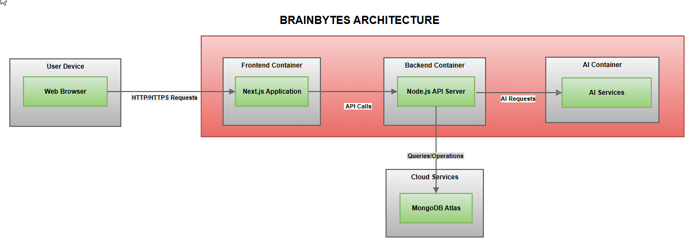

# BrainBytes AI Tutoring Platform

## Project Overview
BrainBytes is an AI-powered tutoring platform designed to provide accessible academic assistance to Filipino students. This project implements the platform using modern DevOps practices and containerization.

## Team Members
- Felicity Diana Sario - Team Lead - lr.fdsario@mmdc.mcl.edu.ph
- Honey Grace Denolan - Backend Developer - lr.hgdenolan@mmdc.mcl.edu.ph
- Rhico Abueme - Frontend Developer - lr.rabueme@mmdc.mcl.edu.ph
- Zyra Joy Dongon - DevOps Engineer - lr.zjdongon@mmdc.mcl.edu.ph


## Project Goals
- Implement a containerized application with proper networking
- Create an automated CI/CD pipeline using GitHub Actions
- Deploy the application to Oracle Cloud Free Tier
- Set up monitoring and observability tools

## Technology Stack
- Frontend: Next.js
- Backend: Node.js/Express.js
- Database: MongoDB
- Containerization: Docker
- CI/CD: GitHub Actions
- Cloud Provider: Oracle Cloud Free Tier
- Monitoring: Prometheus & Grafana
- AI Integration: OpenRouter API (Mistral-7B model)

## Development Environment Setup Verification

| Team Member | Docker Installed | Git Installed | VS Code Installed | Can Run Hello World Container |
|-------------|-----------------|---------------|-------------------|------------------------------|
| Felicity Diana Sario | ✓ | ✓ | ✓ | ✓ |
| Honey Grace Denolan | ✓ | ✓ | ✓ | ✓ |
| Rhico Abueme | ✓ | ✓ | ✓ | ✓ |
| Zyra Joy Dongon | ✓ | ✓ | ✓ | ✓ |


## Project Architecture



## Task Distribution Plan

### Week 1: Container Basics
- Set up project repository and basic documentation
- Research and document containerization approach
- Complete Docker installation and verification

### Week 2: Platform Development
- Implement frontend container (Next.js)
- Implement backend container (Node.js)
- Configure MongoDB and container networking

### Week 3: Platform Development (continued)
- Implement chat interface frontend
- Implement backend API endpoints
- Set up container networking and environment configurations

### Week 4: Integration and Testing
- Integrate OpenRouter AI API
- Implement message history and UI improvements
- Set up monitoring tools
- Create project documentation
- Final testing and preparation for submission

## Current Progress
- [x] Basic project structure set up
- [x] Docker containers configured
- [x] Frontend development started
- [x] Backend API implementation
- [x] MongoDB integration
- [x] AI integration with OpenRouter
- [ ] Monitoring setup
- [ ] CI/CD pipeline
- [ ] Cloud deployment

## Running the Application

### Prerequisites
- Docker and Docker Compose installed
- Node.js 14+ (for local development)

### Environment Setup
Create the following `.env` files:

```bash
# backend/.env
JWT_SECRET=your_jwt_secret
MONGODB_URI=mongodb://mongo:27017/brainbytes

# ai-service/.env
OPENROUTER_API_KEY=your_openrouter_api_key
OPENROUTER_REFERRER=https://brainbytes.ai

# frontend/.env.local
NEXT_PUBLIC_API_URL=http://localhost:3000
NEXT_PUBLIC_AI_SERVICE_URL=http://localhost:3002
```

### Starting the Application
1. Clone the repository
2. Run the application (make sure Docker is Running):
```bash
docker-compose down && docker-compose up -d --build
```

The application will be available at:
- Frontend: http://localhost:3001
- Backend API: http://localhost:3000
- AI Service: http://localhost:3002

## API Documentation

### Authentication Endpoints

#### POST /auth/register
Register a new user
```json
{
  "email": "user@example.com",
  "password": "password123",
  "rememberMe": false
}
```

#### POST /auth/login
Login existing user
```json
{
  "email": "test@example.com",
  "password": "Test12345,",
  "rememberMe": false
}
```

#### POST /auth/logout
Logout current user

### Learning Materials Endpoints

#### GET /learning-materials
Get all learning materials with pagination and filters
- Query Parameters:
  - `subject`: Filter by subject
  - `topic`: Filter by topic
  - `resourceType`: Filter by resource type
  - `difficulty`: Filter by difficulty level
  - `tags`: Filter by tags (comma-separated)
  - `page`: Page number (default: 1)
  - `limit`: Items per page (default: 10, max: 50)
  - `fields`: Select specific fields (comma-separated)
  - `search`: Search in content

#### POST /learning-materials
Create new learning material
```json
{
  "subject": "Mathematics",
  "topic": "Algebra",
  "content": "Content text",
  "resourceType": "explanation",
  "difficulty": "intermediate",
  "tags": ["algebra", "equations"]
}
```

#### GET /learning-materials/subjects
Get list of distinct subjects

#### GET /learning-materials/subjects/:subject
Get materials by subject with pagination

#### GET /learning-materials/:id
Get specific learning material by ID

#### PUT /learning-materials/:id
Update learning material

#### DELETE /learning-materials/:id
Delete learning material

## Database Schema

### Learning Material Schema
```javascript
{
  subject: String,          // Required, indexed
  topic: String,           // Required
  content: String,         // Required
  resourceType: String,    // Required, enum: ['definition', 'explanation', 'example', 'practice']
  difficulty: String,      // enum: ['beginner', 'intermediate', 'advanced']
  tags: [String],         // Optional array of tags
  createdAt: Date,        // Auto-generated, indexed
  updatedAt: Date         // Auto-updated on changes
}
```

Database Indexes:
- Compound index on `{ subject: 1, topic: 1 }`
- Index on `tags`
- Index on `{ resourceType: 1, difficulty: 1 }`
- Index on `createdAt`

### User Profile Schema
```javascript
{
  email: String,          // Required, unique
  name: String,           // Required
  createdAt: Date,        // Auto-generated
  updatedAt: Date         // Auto-updated on changes
}
```

### Auth Schema
```javascript
{
  email: String,          // Required, unique
  password: String,       // Required, hashed
  userProfile: ObjectId,  // Reference to UserProfile
  createdAt: Date,
  updatedAt: Date
}
```

## AI Integration Details

The platform integrates with OpenRouter API using the Mistral-7B model for intelligent tutoring:

### Features
- Natural language understanding
- Contextual conversation memory
- Reference resolution (understanding pronouns and context)
- Concise, focused responses

### Technical Implementation
- Dedicated AI service container running on port 3002
- RESTful API endpoint at `/api/chat`
- Secure API key management
- CORS protection with allowed origins
- Conversation history management
- Health check endpoint at `/health`

The AI service maintains conversation context to provide more natural and coherent tutoring interactions with students.
