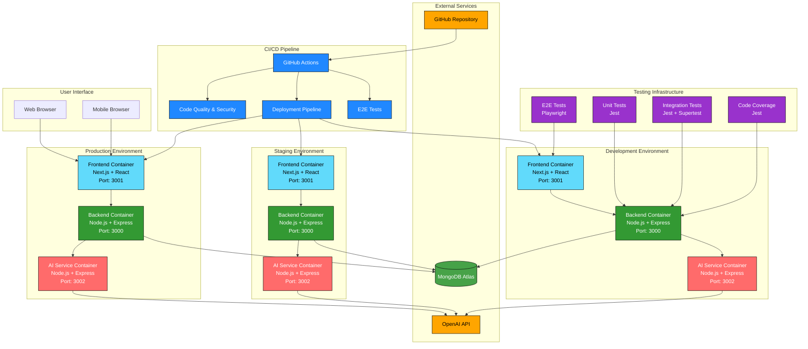
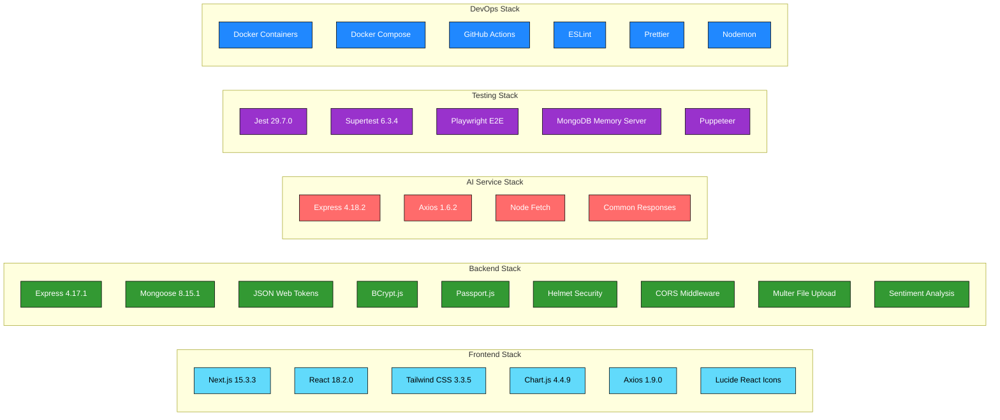
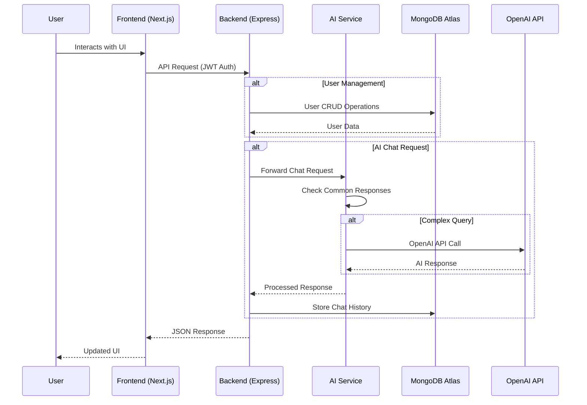
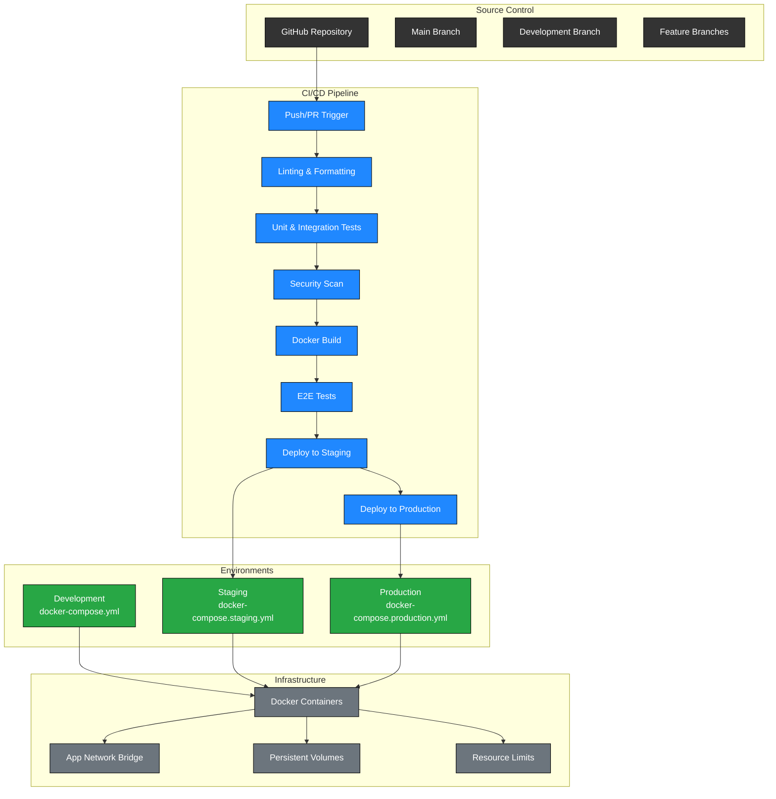
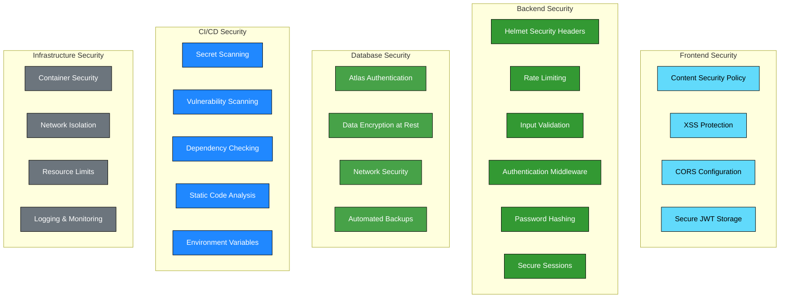
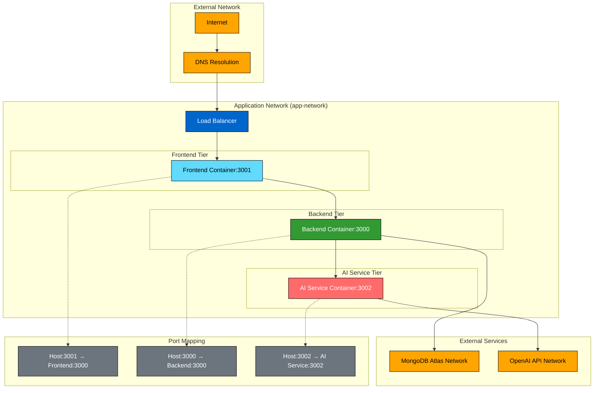

# BrainBytesAI Architecture Diagram

## System Architecture Overview

## Technology Stack Details

## Data Flow Architecture

## Deployment Architecture

## Security Architecture

## Network Architecture

---

## Architecture Summary

This BrainBytesAI system is a modern, containerized educational AI platform with the following key characteristics:

### **Core Services**
- **Frontend**: Next.js 15 with React 18, Tailwind CSS, and Chart.js for data visualization
- **Backend**: Express.js API with comprehensive authentication, security middleware, and MongoDB integration
- **AI Service**: Dedicated service for handling AI interactions with OpenAI API and common response caching

### **Database Architecture**
- **MongoDB Atlas**: Cloud-hosted database with encryption at rest and automated backups
- **No local database**: All environments connect directly to Atlas clusters

### **DevOps & Deployment**
- **Multi-environment**: Development, Staging, and Production configurations
- **Docker containerization**: All services run in isolated containers with resource limits
- **CI/CD Pipeline**: Automated testing, security scanning, and deployment via GitHub Actions
- **Comprehensive testing**: Unit, integration, and E2E testing with Playwright

### **Security Features**
- JWT-based authentication with secure session management
- Comprehensive security headers via Helmet
- Rate limiting and input validation
- Automated security scanning and dependency checking
- Container security and network isolation

### **Monitoring & Quality**
- Code quality enforcement with ESLint and Prettier
- Automated security scans and vulnerability detection
- Resource monitoring and logging
- Performance optimization with memory limits and caching

This architecture provides a scalable, secure, and maintainable foundation for an educational AI platform.