# 🏗️ BrainBytesAI Architecture Diagram

## System Architecture Overview

```mermaid
graph TB
    subgraph "Philippine Users"
        PH_Mobile[📱 Mobile Users<br/>70% of traffic]
        PH_Desktop[💻 Desktop Users<br/>30% of traffic]
        PH_Network[🌐 Philippine Internet<br/>Variable Speed: 5-50 Mbps<br/>Latency: 100-300ms]
    end
    
    subgraph "Global CDN & Edge"
        CDN[🌍 Heroku Edge Network<br/>Global Content Delivery<br/>Auto SSL/TLS]
        Router[⚡ Heroku Router<br/>Load Balancing<br/>Request Routing]
    end
    
    subgraph "Production Environment"
        direction TB
        Frontend_Prod[🖥️ Frontend Production<br/>brainbytes-frontend-production<br/>Next.js + React<br/>Port: 80/443]
        Backend_Prod[🔧 Backend Production<br/>brainbytes-backend-production<br/>Node.js + Express<br/>Port: 80/443]
        AI_Prod[🤖 AI Service Production<br/>brainbytes-ai-production<br/>Node.js + Groq API<br/>Port: 80/443]
    end
    
    subgraph "Staging Environment"
        direction TB
        Frontend_Stage[🖥️ Frontend Staging<br/>brainbytes-frontend-staging<br/>Next.js + React<br/>Port: 80/443]
        Backend_Stage[🔧 Backend Staging<br/>brainbytes-backend-staging<br/>Node.js + Express<br/>Port: 80/443]
        AI_Stage[🤖 AI Service Staging<br/>brainbytes-ai-service-staging<br/>Node.js + Groq API<br/>Port: 80/443]
    end
    
    subgraph "Database Layer"
        MongoDB_Prod[(🗄️ MongoDB Atlas Production<br/>Region: Asia-Pacific (Singapore)<br/>Cluster: M0 Free Tier<br/>Auto Backup: Daily)]
        MongoDB_Stage[(🗄️ MongoDB Atlas Staging<br/>Region: Asia-Pacific (Singapore)<br/>Cluster: M0 Free Tier<br/>Auto Backup: Daily)]
    end
    
    subgraph "External Services"
        Groq[🧠 Groq AI API<br/>Language Model<br/>Chat Completions]
        GitHub[📦 GitHub Repository<br/>Source Code<br/>Actions CI/CD]
    end
    
    subgraph "CI/CD Pipeline"
        direction LR
        Quality[🔍 Code Quality<br/>ESLint, Prettier<br/>Security Scan<br/>Secrets Detection]
        Testing[🧪 CI/CD Pipeline<br/>Unit Tests<br/>E2E Tests<br/>Performance Tests]
        Deploy[🚀 Deployment<br/>Heroku Deploy<br/>Health Checks<br/>Rollback]
    end
    
    %% User connections
    PH_Mobile --> PH_Network
    PH_Desktop --> PH_Network
    PH_Network --> CDN
    
    %% CDN to applications
    CDN --> Router
    Router --> Frontend_Prod
    Router --> Frontend_Stage
    
    %% Application connections
    Frontend_Prod --> Backend_Prod
    Frontend_Stage --> Backend_Stage
    
    Backend_Prod --> AI_Prod
    Backend_Stage --> AI_Stage
    
    Backend_Prod --> MongoDB_Prod
    Backend_Stage --> MongoDB_Stage
    
    AI_Prod --> Groq
    AI_Stage --> Groq
    
    %% CI/CD Flow
    GitHub --> Quality
    Quality --> Testing
    Testing --> Deploy
    Deploy --> Frontend_Prod
    Deploy --> Backend_Prod
    Deploy --> AI_Prod
    Deploy --> Frontend_Stage
    Deploy --> Backend_Stage
    Deploy --> AI_Stage
    
    %% Styling
    classDef userClass fill:#e1f5fe,stroke:#01579b,stroke-width:2px
    classDef prodClass fill:#e8f5e8,stroke:#2e7d32,stroke-width:2px
    classDef stageClass fill:#fff3e0,stroke:#ef6c00,stroke-width:2px
    classDef dbClass fill:#f3e5f5,stroke:#7b1fa2,stroke-width:2px
    classDef externalClass fill:#fce4ec,stroke:#c2185b,stroke-width:2px
    classDef cicdClass fill:#e0f2f1,stroke:#00695c,stroke-width:2px
    
    class PH_Mobile,PH_Desktop,PH_Network userClass
    class Frontend_Prod,Backend_Prod,AI_Prod prodClass
    class Frontend_Stage,Backend_Stage,AI_Stage stageClass
    class MongoDB_Prod,MongoDB_Stage dbClass
    class Groq,GitHub externalClass
    class Quality,Testing,Deploy cicdClass
```

## Network Flow Diagram


## Deployment Pipeline Flow

```mermaid
graph TD
    subgraph "Developer Workflow"
        Dev[👨‍💻 Developer]
        Code[📝 Code Changes]
        Commit[📤 Git Commit]
        Push[⬆️ Git Push]
    end
    
    subgraph "Automated CI/CD"
        Trigger[🎯 Workflow Trigger]
        
        subgraph "Stage 1: Quality Checks"
            Lint[🔍 ESLint/Prettier]
            Security[🔒 Security Scan]
            Secrets[🕵️ Secrets Detection]
            Analysis[📊 Code Analysis]
        end
        
        subgraph "Stage 2: Testing"
            Unit[🧪 Unit Tests]
            Integration[🔗 Integration Tests]
            E2E[🎭 E2E Tests (Playwright)]
            Performance[⚡ Performance Tests]
        end
        
        subgraph "Stage 3: Deployment"
            BuildStage[🏗️ Build Staging]
            DeployStage[🚀 Deploy Staging]
            HealthStage[❤️ Health Check Staging]
            BuildProd[🏗️ Build Production]
            DeployProd[🚀 Deploy Production]
            HealthProd[❤️ Health Check Production]
        end
    end
    
    subgraph "Environment Status"
        StagingEnv[🧪 Staging Environment<br/>✅ Ready for Testing]
        ProdEnv[🏭 Production Environment<br/>✅ Live for Users]
    end
    
    subgraph "Monitoring & Alerts"
        Monitor[📊 Application Monitoring]
        Alerts[🚨 Alert System]
        Logs[📋 Log Aggregation]
    end
    
    %% Developer flow
    Dev --> Code --> Commit --> Push --> Trigger
    
    %% Quality checks
    Trigger --> Lint
    Trigger --> Security
    Trigger --> Secrets
    Trigger --> Analysis
    
    %% Testing phase
    Lint --> Unit
    Security --> Integration
    Secrets --> E2E
    Analysis --> Performance
    
    %% Deployment phase
    Unit --> BuildStage
    Integration --> DeployStage
    E2E --> HealthStage
    Performance --> BuildProd
    
    HealthStage --> BuildProd
    BuildProd --> DeployProd
    DeployProd --> HealthProd
    
    %% Environment updates
    DeployStage --> StagingEnv
    DeployProd --> ProdEnv
    
    %% Monitoring
    StagingEnv --> Monitor
    ProdEnv --> Monitor
    Monitor --> Alerts
    Monitor --> Logs
    
    %% Rollback capability
    HealthProd -.->|Failure| DeployProd
    HealthStage -.->|Failure| DeployStage
    
    %% Styling
    classDef devClass fill:#e3f2fd,stroke:#1976d2,stroke-width:2px
    classDef qualityClass fill:#f1f8e9,stroke:#388e3c,stroke-width:2px
    classDef testClass fill:#fff8e1,stroke:#f57c00,stroke-width:2px
    classDef deployClass fill:#fce4ec,stroke:#c2185b,stroke-width:2px
    classDef envClass fill:#e8eaf6,stroke:#3f51b5,stroke-width:2px
    classDef monitorClass fill:#efebe9,stroke:#5d4037,stroke-width:2px
    
    class Dev,Code,Commit,Push devClass
    class Lint,Security,Secrets,Analysis qualityClass
    class Unit,Integration,E2E,Performance testClass
    class BuildStage,DeployStage,HealthStage,BuildProd,DeployProd,HealthProd deployClass
    class StagingEnv,ProdEnv envClass
    class Monitor,Alerts,Logs monitorClass
```

## Philippine-Specific Optimization Architecture

```mermaid
graph TB
    subgraph "Philippine User Experience Optimization"
        subgraph "Connection Challenges"
            Slow[🐌 Slow Connections<br/>2G/3G Networks<br/>5-25 Mbps]
            Variable[📶 Variable Quality<br/>Frequent Drops<br/>High Latency]
            Mobile[📱 Mobile First<br/>70% Mobile Users<br/>Touch Interface]
        end
        
        subgraph "Optimization Solutions"
            PWA[📱 Progressive Web App<br/>Offline Capability<br/>App-like Experience]
            Cache[💾 Intelligent Caching<br/>ServiceWorker<br/>Local Storage]
            Compress[🗜️ Content Compression<br/>Gzip/Brotli<br/>Image Optimization]
            Lazy[⏳ Lazy Loading<br/>Progressive Enhancement<br/>Critical Path]
        end
        
        subgraph "Data Minimization"
            API[📡 Efficient APIs<br/>Pagination<br/>Field Selection]
            Images[🖼️ Optimized Images<br/>WebP Format<br/>Responsive Sizes]
            Bundle[📦 Code Splitting<br/>Tree Shaking<br/>Minimal Bundles]
        end
    end
    
    subgraph "Resilience Features"
        subgraph "Offline Capability"
            OfflineUI[📱 Offline UI<br/>Cached Content<br/>Queue Actions]
            Sync[🔄 Background Sync<br/>Auto Retry<br/>Conflict Resolution]
        end
        
        subgraph "Connection Recovery"
            Circuit[⚡ Circuit Breaker<br/>Failure Detection<br/>Auto Recovery]
            Retry[🔁 Smart Retry<br/>Exponential Backoff<br/>Connection Detection]
        end
    end
    
    subgraph "Compliance & Privacy"
        Privacy[🔒 Data Privacy Act<br/>User Consent<br/>Data Minimization]
        Education[📚 Educational Data<br/>FERPA Compliance<br/>Parental Consent]
        Local[🇵🇭 Local Regulations<br/>Data Residency<br/>Audit Trail]
    end
    
    %% Connections
    Slow --> PWA
    Variable --> Cache
    Mobile --> Compress
    
    PWA --> OfflineUI
    Cache --> Sync
    Compress --> Circuit
    Lazy --> Retry
    
    API --> Privacy
    Images --> Education
    Bundle --> Local
    
    %% Styling
    classDef challengeClass fill:#ffebee,stroke:#d32f2f,stroke-width:2px
    classDef solutionClass fill:#e8f5e8,stroke:#2e7d32,stroke-width:2px
    classDef resilienceClass fill:#e3f2fd,stroke:#1976d2,stroke-width:2px
    classDef complianceClass fill:#f3e5f5,stroke:#7b1fa2,stroke-width:2px
    
    class Slow,Variable,Mobile challengeClass
    class PWA,Cache,Compress,Lazy,API,Images,Bundle solutionClass
    class OfflineUI,Sync,Circuit,Retry resilienceClass
    class Privacy,Education,Local complianceClass
```



## Technology Stack Architecture

```mermaid
graph TB
    subgraph "Frontend Stack"
        React[⚛️ React 18<br/>Component Library<br/>State Management]
        NextJS[⚡ Next.js 14<br/>SSR/SSG<br/>API Routes<br/>Performance]
        Tailwind[🎨 Tailwind CSS<br/>Utility-First<br/>Responsive Design]
        PWA_Tech[📱 PWA Technologies<br/>Service Workers<br/>Web App Manifest]
    end
    
    subgraph "Backend Stack"
        NodeJS[🟢 Node.js 18+<br/>JavaScript Runtime<br/>Event-Driven]
        Express[🚀 Express.js<br/>Web Framework<br/>Middleware<br/>REST API]
        JWT[🔐 JWT Authentication<br/>Stateless Auth<br/>Token-Based]
        Validation[✅ Input Validation<br/>Joi/Yup<br/>Security]
    end
    
    subgraph "AI/ML Stack"
        Groq[🧠 Groq API<br/>Language Models<br/>Fast Inference]
        AIService[🤖 AI Service<br/>Request Processing<br/>Context Management]
    end
    
    subgraph "Database Stack"
        MongoDB[🍃 MongoDB Atlas<br/>Document Database<br/>Cloud Managed]
        Mongoose[🦫 Mongoose ODM<br/>Schema Validation<br/>Query Builder]
    end
    
    subgraph "DevOps Stack"
        Heroku[☁️ Heroku Platform<br/>Cloud Hosting<br/>Auto Scaling]
        GitHub[📦 GitHub Actions<br/>CI/CD Pipeline<br/>Automation]
        Docker[🐳 Docker<br/>Containerization<br/>Deployment]
    end
    
    subgraph "Monitoring Stack"
        Logging[📋 Winston Logging<br/>Structured Logs<br/>Error Tracking]
        Health[❤️ Health Checks<br/>Service Monitoring<br/>Uptime Tracking]
        Performance[📊 Performance Monitoring<br/>Response Times<br/>Resource Usage]
    end
    
    %% Frontend connections
    React --> NextJS
    NextJS --> Tailwind
    NextJS --> PWA_Tech
    
    %% Backend connections
    NodeJS --> Express
    Express --> JWT
    Express --> Validation
    
    %% AI connections
    Groq --> AIService
    
    %% Database connections
    MongoDB --> Mongoose
    
    %% DevOps connections
    Heroku --> GitHub
    GitHub --> Docker
    
    %% Cross-stack connections
    NextJS -.-> Express
    Express -.-> Mongoose
    Express -.-> AIService
    AIService -.-> Groq
    
    %% Monitoring connections
    Express --> Logging
    Express --> Health
    Express --> Performance
    
    %% Styling
    classDef frontendClass fill:#e1f5fe,stroke:#01579b,stroke-width:2px
    classDef backendClass fill:#e8f5e8,stroke:#2e7d32,stroke-width:2px
    classDef aiClass fill:#fff3e0,stroke:#ef6c00,stroke-width:2px
    classDef dbClass fill:#f3e5f5,stroke:#7b1fa2,stroke-width:2px
    classDef devopsClass fill:#fce4ec,stroke:#c2185b,stroke-width:2px
    classDef monitorClass fill:#efebe9,stroke:#5d4037,stroke-width:2px
    
    class React,NextJS,Tailwind,PWA_Tech frontendClass
    class NodeJS,Express,JWT,Validation backendClass
    class Groq,AIService aiClass
    class MongoDB,Mongoose dbClass
    class Heroku,GitHub,Docker devopsClass
    class Logging,Health,Performance monitorClass
```



## Security Architecture

```mermaid
graph TB
    subgraph "Application Security Layers"
        subgraph "Frontend Security"
            CSP[🛡️ Content Security Policy<br/>XSS Prevention<br/>Script Control]
            HTTPS[🔒 HTTPS Enforcement<br/>TLS 1.3<br/>Certificate Management]
            Auth[🔑 Client Authentication<br/>JWT Tokens<br/>Secure Storage]
        end
        
        subgraph "API Security"
            RateLimit[⏱️ Rate Limiting<br/>DDoS Protection<br/>API Throttling]
            Validation[✅ Input Validation<br/>SQL Injection Prevention<br/>Data Sanitization]
            CORS[🌐 CORS Policy<br/>Origin Control<br/>Method Restrictions]
        end
        
        subgraph "Database Security"
            Encryption[🔐 Encryption at Rest<br/>Atlas Security<br/>Connection Encryption]
            Access[👤 Access Control<br/>IP Whitelisting<br/>User Permissions]
            Backup[💾 Secure Backups<br/>Encrypted Storage<br/>Point-in-Time Recovery]
        end
    end
    
    subgraph "CI/CD Security"
        Secrets[🔒 GitHub Secrets<br/>Environment Variables<br/>Key Management]
        Scanning[🔍 Security Scanning<br/>Vulnerability Detection<br/>Dependency Audit]
        SAST[📊 Static Analysis<br/>Code Quality<br/>Security Rules]
    end
    
    subgraph "Monitoring & Compliance"
        Audit[📝 Audit Logging<br/>Access Tracking<br/>Security Events]
        Privacy[🇵🇭 Privacy Compliance<br/>Data Protection Act<br/>User Consent]
        Incident[🚨 Incident Response<br/>Security Alerts<br/>Automated Response]
    end
    
    %% Security flow
    CSP --> RateLimit
    HTTPS --> Validation
    Auth --> CORS
    
    RateLimit --> Encryption
    Validation --> Access
    CORS --> Backup
    
    Encryption --> Secrets
    Access --> Scanning
    Backup --> SAST
    
    Secrets --> Audit
    Scanning --> Privacy
    SAST --> Incident
    
    %% Styling
    classDef frontendSec fill:#e8f5e8,stroke:#2e7d32,stroke-width:2px
    classDef apiSec fill:#e3f2fd,stroke:#1976d2,stroke-width:2px
    classDef dbSec fill:#f3e5f5,stroke:#7b1fa2,stroke-width:2px
    classDef cicdSec fill:#fff3e0,stroke:#ef6c00,stroke-width:2px
    classDef monitorSec fill:#ffebee,stroke:#d32f2f,stroke-width:2px
    
    class CSP,HTTPS,Auth frontendSec
    class RateLimit,Validation,CORS apiSec
    class Encryption,Access,Backup dbSec
    class Secrets,Scanning,SAST cicdSec
    class Audit,Privacy,Incident monitorSec
```



---

## Architecture Decision Records (ADRs)

### ADR-001: Platform Choice - Heroku vs Oracle Cloud
**Decision**: Use Heroku instead of Oracle Cloud  
**Rationale**: 
- Simplified deployment and maintenance
- Better GitHub Actions integration
- Managed infrastructure reduces operational overhead
- Built-in CDN benefits Philippine users
- Free tier sufficient for educational project

### ADR-002: Database Choice - MongoDB Atlas
**Decision**: Use MongoDB Atlas (Asia-Pacific region)  
**Rationale**: 
- Managed service reduces DBA overhead
- Singapore region optimizes latency for Philippine users
- Automatic backups and scaling
- Strong security features
- Free tier available

### ADR-003: AI Service Integration - Groq API
**Decision**: Integrate with Groq API for AI capabilities  
**Rationale**: 
- Fast inference speeds
- Cost-effective for educational use
- Simple REST API integration
- Good documentation and support
- Suitable for chat-based AI applications

### ADR-004: Philippine-Specific Optimizations
**Decision**: Implement mobile-first, offline-capable PWA  
**Rationale**: 
- 70% of Philippine users access via mobile
- Variable internet connectivity requires offline capability
- Data usage minimization important due to cost
- Progressive enhancement for better user experience

### ADR-005: Security Implementation
**Decision**: JWT-based authentication with comprehensive security scanning  
**Rationale**: 
- Stateless authentication suitable for distributed deployment
- Automated security scanning prevents vulnerabilities
- Compliance with Philippine Data Privacy Act requirements
- Educational data protection considerations

---

This architecture documentation provides a comprehensive visual representation of the BrainBytesAI system, specifically optimized for deployment on Heroku with Philippine user considerations.