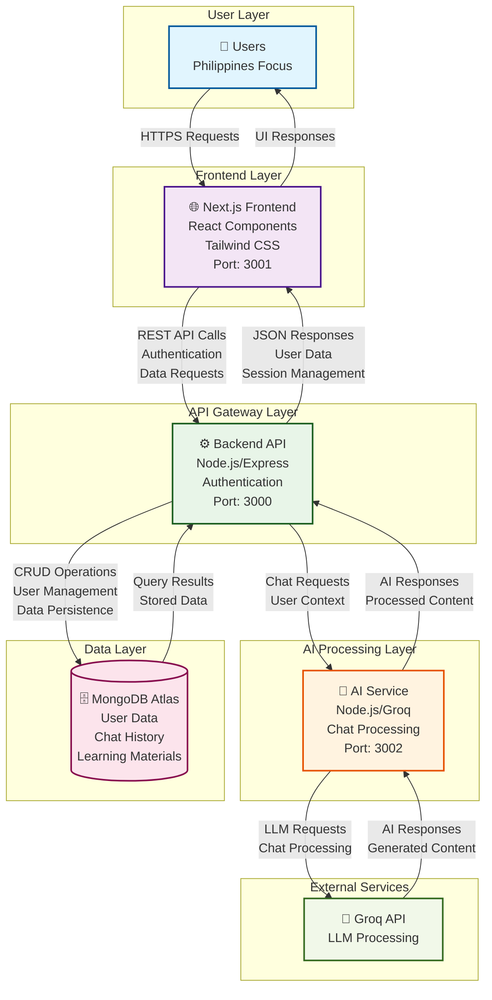

```mermaid
graph TB
    subgraph "User Layer"
        U[👤 Users<br/>Philippines Focus]
    end
    
    subgraph "Frontend Layer"
        FE[🌐 Next.js Frontend<br/>React Components<br/>Tailwind CSS<br/>Port: 3001]
    end
    
    subgraph "API Gateway Layer"
        BE[⚙️ Backend API<br/>Node.js/Express<br/>Authentication<br/>Port: 3000]
    end
    
    subgraph "AI Processing Layer"
        AI[🤖 AI Service<br/>Node.js/Groq<br/>Chat Processing<br/>Port: 3002]
    end
    
    subgraph "Data Layer"
        DB[(🗄️ MongoDB Atlas<br/>User Data<br/>Chat History<br/>Learning Materials)]
    end
    
    subgraph "External Services"
        GROQ[🧠 Groq API<br/>LLM Processing]
    end
    
    %% User interactions
    U -->|HTTPS Requests| FE
    FE -->|UI Responses| U
    
    %% Frontend to Backend
    FE -->|REST API Calls<br/>Authentication<br/>Data Requests| BE
    BE -->|JSON Responses<br/>User Data<br/>Session Management| FE
    
    %% Backend to AI Service
    BE -->|Chat Requests<br/>User Context| AI
    AI -->|AI Responses<br/>Processed Content| BE
    
    %% Backend to Database
    BE -->|CRUD Operations<br/>User Management<br/>Data Persistence| DB
    DB -->|Query Results<br/>Stored Data| BE
    
    %% AI Service to External
    AI -->|LLM Requests<br/>Chat Processing| GROQ
    GROQ -->|AI Responses<br/>Generated Content| AI
    
    %% Styling
    classDef userClass fill:#e1f5fe,stroke:#01579b,stroke-width:2px
    classDef frontendClass fill:#f3e5f5,stroke:#4a148c,stroke-width:2px
    classDef backendClass fill:#e8f5e8,stroke:#1b5e20,stroke-width:2px
    classDef aiClass fill:#fff3e0,stroke:#e65100,stroke-width:2px
    classDef dataClass fill:#fce4ec,stroke:#880e4f,stroke-width:2px
    classDef externalClass fill:#f1f8e9,stroke:#33691e,stroke-width:2px
    
    class U userClass
    class FE frontendClass
    class BE backendClass
    class AI aiClass
    class DB dataClass
    class GROQ externalClass
```