# 🏗️ BrainBytesAI Architecture Diagrams

This document contains the comprehensive architecture diagrams for the BrainBytesAI platform, designed for academic evaluation and documentation purposes.

---

## 1. High-Level System Architecture

### Application Flow Diagram

```mermaid
graph TB
    subgraph "User Layer"
        U[👤 Users<br/>Philippines Focus]
    end
    
    subgraph "Frontend Layer"
        FE[🌐 Next.js Frontend<br/>React Components<br/>Tailwind CSS]
    end
    
    subgraph "API Gateway Layer"
        BE[⚙️ Backend API<br/>Node.js/Express<br/>Authentication]
    end
    
    subgraph "AI Processing Layer"
        AI[🤖 AI Service<br/>Node.js/Groq<br/>Chat Processing]
    end
    
    subgraph "Data Layer"
        DB[(🗄️ MongoDB Atlas<br/>User Data<br/>Chat History<br/>Learning Materials)]
    end
    
    subgraph "External Services"
        GROQ[🧠 Groq API<br/>LLM Processing]
    end
    
    %% User interactions
    U -->|HTTPS Requests| FE
    FE -->|UI Responses| U
    
    %% Frontend to Backend
    FE -->|REST API Calls<br/>Authentication<br/>Data Requests| BE
    BE -->|JSON Responses<br/>User Data<br/>Session Management| FE
    
    %% Backend to AI Service
    BE -->|Chat Requests<br/>User Context| AI
    AI -->|AI Responses<br/>Processed Content| BE
    
    %% Backend to Database
    BE -->|CRUD Operations<br/>User Management<br/>Data Persistence| DB
    DB -->|Query Results<br/>Stored Data| BE
    
    %% AI Service to External
    AI -->|LLM Requests<br/>Chat Processing| GROQ
    GROQ -->|AI Responses<br/>Generated Content| AI
    
    %% Styling
    classDef userClass fill:#e1f5fe,stroke:#01579b,stroke-width:2px
    classDef frontendClass fill:#f3e5f5,stroke:#4a148c,stroke-width:2px
    classDef backendClass fill:#e8f5e8,stroke:#1b5e20,stroke-width:2px
    classDef aiClass fill:#fff3e0,stroke:#e65100,stroke-width:2px
    classDef dataClass fill:#fce4ec,stroke:#880e4f,stroke-width:2px
    classDef externalClass fill:#f1f8e9,stroke:#33691e,stroke-width:2px
    
    class U userClass
    class FE frontendClass
    class BE backendClass
    class AI aiClass
    class DB dataClass
    class GROQ externalClass
```

---

## 2. Development Environment Architecture

### Local Development Setup

```mermaid
graph TB
    subgraph "Development Machine"
        subgraph "Frontend Service"
            DEV_FE[🌐 Next.js Frontend<br/>localhost:3001<br/>Hot Reload]
        end
        
        subgraph "Backend Service"
            DEV_BE[⚙️ Backend API<br/>localhost:3000<br/>Express Server]
        end
        
        subgraph "AI Service"
            DEV_AI[🤖 AI Service<br/>localhost:3002<br/>Groq Integration]
        end
    end
    
    subgraph "External Services"
        DEV_DB[(🗄️ MongoDB Atlas<br/>Development Cluster<br/>mongodb+srv://...)]
        GROQ_DEV[🧠 Groq API<br/>Development Keys]
    end
    
    %% Development Flow
    DEV_FE -->|API Calls :3000| DEV_BE
    DEV_BE -->|Service Calls :3002| DEV_AI
    DEV_BE -->|Database Queries| DEV_DB
    DEV_AI -->|LLM Requests| GROQ_DEV
    
    %% Styling
    classDef devClass fill:#e3f2fd,stroke:#0d47a1,stroke-width:2px
    classDef externalClass fill:#f3e5f5,stroke:#7b1fa2,stroke-width:2px
    
    class DEV_FE,DEV_BE,DEV_AI devClass
    class DEV_DB,GROQ_DEV externalClass
```

---

## 3. Production Environment Architecture

### Heroku Production Deployment

```mermaid
graph TB
    subgraph "Internet Traffic"
        USERS[🌍 Global Users<br/>Primary: Philippines<br/>HTTPS Traffic]
    end
    
    subgraph "Heroku Platform"
        subgraph "Production Apps"
            P_FE[🌐 Frontend Production<br/>brainbytes-frontend-production-03d1e6b6b158.herokuapp.com<br/>Port 80/443]
            P_BE[⚙️ Backend Production<br/>brainbytes-backend-production-d355616d0f1f.herokuapp.com<br/>Port 80/443]
            P_AI[🤖 AI Service Production<br/>brainbytes-ai-production-3833f742ba79.herokuapp.com<br/>Port 80/443]
        end
        
        subgraph "Staging Apps"
            S_FE[🌐 Frontend Staging<br/>brainbytes-frontend-staging-7593f4655363.herokuapp.com<br/>Port 80/443]
            S_BE[⚙️ Backend Staging<br/>brainbytes-backend-staging-de872da2939f.herokuapp.com<br/>Port 80/443]
            S_AI[🤖 AI Service Staging<br/>brainbytes-ai-service-staging-4b75c77cf53a.herokuapp.com<br/>Port 80/443]
        end
    end
    
    subgraph "Database Layer"
        P_DB[(🗄️ MongoDB Atlas<br/>Production Cluster<br/>Singapore Region<br/>Port 27017)]
        S_DB[(🗄️ MongoDB Atlas<br/>Staging Cluster<br/>Singapore Region<br/>Port 27017)]
    end
    
    subgraph "External APIs"
        GROQ[🧠 Groq API<br/>AI Processing<br/>HTTPS Endpoints]
    end
    
    %% Production Flow
    USERS -->|HTTPS| P_FE
    P_FE -->|Internal API Calls| P_BE
    P_BE -->|Microservice Calls| P_AI
    P_BE -->|Database Queries| P_DB
    P_AI -->|LLM API Calls| GROQ
    
    %% Staging Flow
    USERS -->|HTTPS Testing| S_FE
    S_FE -->|Internal API Calls| S_BE
    S_BE -->|Microservice Calls| S_AI
    S_BE -->|Database Queries| S_DB
    S_AI -->|LLM API Calls| GROQ
    
    %% Styling
    classDef userClass fill:#e1f5fe,stroke:#01579b,stroke-width:3px
    classDef prodClass fill:#e8f5e8,stroke:#1b5e20,stroke-width:2px
    classDef stagingClass fill:#fff3e0,stroke:#e65100,stroke-width:2px
    classDef dbClass fill:#fce4ec,stroke:#880e4f,stroke-width:2px
    classDef externalClass fill:#f1f8e9,stroke:#33691e,stroke-width:2px
    
    class USERS userClass
    class P_FE,P_BE,P_AI,P_DB prodClass
    class S_FE,S_BE,S_AI,S_DB stagingClass
    class GROQ externalClass
```

---

## 4. CI/CD Pipeline Architecture

### Multi-Environment Deployment Strategy

```mermaid
graph TB
    subgraph "Development"
        DEV_GH[📚 GitHub Repository<br/>Source Code<br/>Documentation]
    end
    
    subgraph "CI/CD Pipeline"
        subgraph "GitHub Actions"
            CQ[🔍 Code Quality<br/>ESLint, Prettier<br/>Security Scan]
            CI[🧪 CI/CD Pipeline<br/>Unit Tests<br/>Integration Tests<br/>E2E Tests]
            CD[🚀 Deploy Pipeline<br/>Docker Build<br/>Multi-platform<br/>Health Checks]
        end
    end
    
    subgraph "Container Registry"
        REG[📦 GitHub Container Registry<br/>ghcr.io<br/>Docker Images<br/>Multi-platform]
    end
    
    subgraph "Deployment Targets"
        STAGING[🟡 Staging Environment<br/>Auto-deploy from main<br/>Heroku Apps]
        PROD[🟢 Production Environment<br/>Manual approval required<br/>Heroku Apps]
    end
    
    subgraph "External Services"
        GROQ_API[🧠 Groq API<br/>AI Processing]
        MONGO[🗄️ MongoDB Atlas<br/>Database Clusters]
    end
    
    %% Development Flow
    DEV_GH -->|Push/PR| CQ
    CQ -->|Quality Gates Pass| CI
    CI -->|Tests Pass| CD
    CD -->|Build Images| REG
    
    %% Deployment Flow
    REG -->|Auto Deploy| STAGING
    REG -->|Manual Deploy| PROD
    
    %% External Dependencies
    STAGING -->|API Integration| GROQ_API
    STAGING -->|Database Connection| MONGO
    PROD -->|API Integration| GROQ_API
    PROD -->|Database Connection| MONGO
    
    %% Styling
    classDef devClass fill:#e3f2fd,stroke:#0d47a1,stroke-width:2px
    classDef cicdClass fill:#f1f8e9,stroke:#2e7d32,stroke-width:2px
    classDef registryClass fill:#fce4ec,stroke:#c2185b,stroke-width:2px
    classDef deployClass fill:#fff8e1,stroke:#f57f17,stroke-width:2px
    classDef externalClass fill:#f3e5f5,stroke:#7b1fa2,stroke-width:2px
    
    class DEV_GH devClass
    class CQ,CI,CD cicdClass
    class REG registryClass
    class STAGING,PROD deployClass
    class GROQ_API,MONGO externalClass
```

---

## 5. Network Topology and Routing

### Heroku Infrastructure with MongoDB Atlas

```mermaid
graph TB
    subgraph "Internet"
        USERS[🌍 Global Users<br/>Primary: Philippines<br/>HTTPS Traffic]
    end
    
    subgraph "Heroku Cloud Platform"
        subgraph "Edge Network"
            EDGE[🌐 Heroku Edge Network<br/>Global CDN<br/>SSL Termination<br/>DDoS Protection]
        end
        
        subgraph "Routing Layer"
            ROUTER[🔀 Heroku Router<br/>Load Balancing<br/>Request Routing<br/>SSL/TLS Handling]
        end
        
        subgraph "Application Dynos - Production"
            direction LR
            P_DYNO_FE[📱 Frontend Dyno<br/>web process<br/>512MB RAM<br/>1x CPU]
            P_DYNO_BE[⚙️ Backend Dyno<br/>web process<br/>512MB RAM<br/>1x CPU]
            P_DYNO_AI[🤖 AI Service Dyno<br/>web process<br/>512MB RAM<br/>1x CPU]
        end
        
        subgraph "Application Dynos - Staging"
            direction LR
            S_DYNO_FE[📱 Frontend Dyno<br/>web process<br/>512MB RAM<br/>1x CPU]
            S_DYNO_BE[⚙️ Backend Dyno<br/>web process<br/>512MB RAM<br/>1x CPU]
            S_DYNO_AI[🤖 AI Service Dyno<br/>web process<br/>512MB RAM<br/>1x CPU]
        end
    end
    
    subgraph "MongoDB Atlas - Asia Pacific"
        subgraph "Production Cluster"
            P_PRIMARY[(🗄️ Primary Node<br/>M0 Sandbox<br/>Singapore Region)]
            P_REPLICA[(🔄 Replica Set<br/>Automatic Failover<br/>Data Replication)]
        end
        
        subgraph "Staging Cluster"
            S_PRIMARY[(🗄️ Primary Node<br/>M0 Sandbox<br/>Singapore Region)]
            S_REPLICA[(🔄 Replica Set<br/>Automatic Failover<br/>Data Replication)]
        end
    end
    
    subgraph "External APIs"
        GROQ[🧠 Groq API<br/>AI/ML Processing<br/>HTTPS Endpoints<br/>Rate Limited]
    end
    
    %% User to Heroku Flow
    USERS -->|HTTPS Requests<br/>DNS Resolution| EDGE
    EDGE -->|Traffic Distribution<br/>Geographic Routing| ROUTER
    
    %% Production Routing
    ROUTER -->|brainbytes-frontend-production-03d1e6b6b158.herokuapp.com<br/>HTTPS| P_DYNO_FE
    ROUTER -->|brainbytes-backend-production-d355616d0f1f.herokuapp.com<br/>HTTPS| P_DYNO_BE
    ROUTER -->|brainbytes-ai-production-3833f742ba79.herokuapp.com<br/>HTTPS| P_DYNO_AI
    
    %% Staging Routing
    ROUTER -->|brainbytes-frontend-staging-7593f4655363.herokuapp.com<br/>HTTPS| S_DYNO_FE
    ROUTER -->|brainbytes-backend-staging-de872da2939f.herokuapp.com<br/>HTTPS| S_DYNO_BE
    ROUTER -->|brainbytes-ai-service-staging-4b75c77cf53a.herokuapp.com<br/>HTTPS| S_DYNO_AI
    
    %% Production Internal Communication
    P_DYNO_FE -->|REST API Calls<br/>Internal Heroku Network| P_DYNO_BE
    P_DYNO_BE -->|Microservice Calls<br/>Internal Network| P_DYNO_AI
    
    %% Staging Internal Communication
    S_DYNO_FE -->|REST API Calls<br/>Internal Heroku Network| S_DYNO_BE
    S_DYNO_BE -->|Microservice Calls<br/>Internal Network| S_DYNO_AI
    
    %% Database Connections
    P_DYNO_BE -->|MongoDB Connection<br/>TLS Encrypted<br/>Connection Pooling| P_PRIMARY
    P_PRIMARY -.->|Replication<br/>Automatic Sync| P_REPLICA
    
    S_DYNO_BE -->|MongoDB Connection<br/>TLS Encrypted<br/>Connection Pooling| S_PRIMARY
    S_PRIMARY -.->|Replication<br/>Automatic Sync| S_REPLICA
    
    %% External API Calls
    P_DYNO_AI -->|HTTPS API Calls<br/>Authentication Headers<br/>Rate Limiting| GROQ
    S_DYNO_AI -->|HTTPS API Calls<br/>Authentication Headers<br/>Rate Limiting| GROQ
    
    %% Response Flow
    EDGE -->|Response Caching<br/>Compression<br/>Security Headers| USERS
    
    %% Styling
    classDef userClass fill:#e1f5fe,stroke:#01579b,stroke-width:3px
    classDef infraClass fill:#f3e5f5,stroke:#4a148c,stroke-width:2px
    classDef prodClass fill:#e8f5e8,stroke:#1b5e20,stroke-width:2px
    classDef stagingClass fill:#fff3e0,stroke:#e65100,stroke-width:2px
    classDef dbClass fill:#fce4ec,stroke:#880e4f,stroke-width:2px
    classDef externalClass fill:#f1f8e9,stroke:#33691e,stroke-width:2px
    
    class USERS userClass
    class EDGE,ROUTER infraClass
    class P_DYNO_FE,P_DYNO_BE,P_DYNO_AI,P_PRIMARY,P_REPLICA prodClass
    class S_DYNO_FE,S_DYNO_BE,S_DYNO_AI,S_PRIMARY,S_REPLICA stagingClass
    class GROQ externalClass
```

---

## 4. Data Flow Architecture

### Request Processing Flow

```mermaid
sequenceDiagram
    participant U as 👤 User<br/>(Philippines)
    participant CDN as 🌐 Heroku Edge
    participant FE as 📱 Frontend<br/>(Next.js)
    participant BE as ⚙️ Backend API<br/>(Express)
    participant AI as 🤖 AI Service<br/>(Node.js)
    participant DB as 🗄️ MongoDB<br/>(Atlas)
    participant GROQ as 🧠 Groq API
    
    Note over U,GROQ: User Chat Interaction Flow
    
    U->>+CDN: HTTPS Request<br/>brainbytes-frontend-production-03d1e6b6b158.herokuapp.com
    CDN->>+FE: Route to Frontend Dyno
    FE->>-CDN: Serve React App<br/>(Static Assets)
    CDN->>-U: Frontend Application<br/>(Cached at Edge)
    
    Note over U,GROQ: Authentication Flow
    
    U->>+FE: Login Request<br/>(username/password)
    FE->>+BE: POST /api/auth/login<br/>(credentials)
    BE->>+DB: Query User Collection<br/>(authentication)
    DB->>-BE: User Data<br/>(if valid)
    BE->>-FE: JWT Token<br/>(session cookie)
    FE->>-U: Authentication Success<br/>(redirect to dashboard)
    
    Note over U,GROQ: Chat Processing Flow
    
    U->>+FE: Send Chat Message<br/>("Help me with calculus")
    FE->>+BE: POST /api/messages<br/>(message + JWT)
    BE->>BE: Validate JWT Token<br/>(middleware)
    BE->>+AI: POST /api/chat<br/>(user message + context)
    AI->>+GROQ: LLM API Request<br/>(structured prompt)
    GROQ->>-AI: AI Response<br/>(generated content)
    AI->>-BE: Processed Response<br/>(formatted chat)
    BE->>+DB: Store Chat History<br/>(user_id + messages)
    DB->>-BE: Confirmation<br/>(document saved)
    BE->>-FE: Chat Response<br/>(AI message)
    FE->>-U: Display AI Response<br/>(real-time UI update)
    
    Note over U,GROQ: File Upload Flow
    
    U->>+FE: Upload Learning Material<br/>(PDF/DOCX file)
    FE->>+BE: POST /api/learning-materials<br/>(multipart/form-data)
    BE->>BE: File Validation<br/>(size, type, security)
    BE->>+DB: Store File Metadata<br/>(file info + user_id)
    DB->>-BE: File Document Created
    BE->>-FE: Upload Success<br/>(file metadata)
    FE->>-U: Upload Confirmation<br/>(file listed)
    
    Note over U,GROQ: Performance Considerations
    
    rect rgb(255, 245, 238)
        Note right of CDN: Edge Caching<br/>Static Assets<br/>Philippines Region
    end
    
    rect rgb(232, 245, 233)
        Note right of DB: Connection Pooling<br/>Singapore Region<br/>Low Latency
    end
    
    rect rgb(227, 242, 253)
        Note right of GROQ: Rate Limiting<br/>Error Handling<br/>Retry Logic
    end
```

---

## 5. Technology Stack Overview

### Component Technology Mapping

```mermaid
graph LR
    subgraph "Frontend Stack"
        FE_TECH[🌐 Frontend Technologies<br/>• Next.js 14<br/>• React 18<br/>• Tailwind CSS<br/>• Jest Testing<br/>• ESLint/Prettier]
    end
    
    subgraph "Backend Stack"
        BE_TECH[⚙️ Backend Technologies<br/>• Node.js 18/20/22<br/>• Express.js<br/>• MongoDB Driver<br/>• JWT Authentication<br/>• Multer File Upload]
    end
    
    subgraph "AI Stack"
        AI_TECH[🤖 AI Technologies<br/>• Node.js Runtime<br/>• Groq SDK<br/>• LLM Processing<br/>• Context Management<br/>• Response Formatting]
    end
    
    subgraph "Database Stack"
        DB_TECH[🗄️ Database Technologies<br/>• MongoDB Atlas<br/>• Mongoose ODM<br/>• Connection Pooling<br/>• Replica Sets<br/>• Auto-scaling]
    end
    
    subgraph "DevOps Stack"
        DEVOPS_TECH[🔧 DevOps Technologies<br/>• GitHub Actions<br/>• Docker Containers<br/>• Heroku Platform<br/>• Playwright E2E<br/>• Artillery Load Testing]
    end
    
    subgraph "Monitoring Stack"
        MON_TECH[📊 Monitoring Technologies<br/>• Heroku Metrics<br/>• MongoDB Monitoring<br/>• GitHub Insights<br/>• Application Logs<br/>• Health Checks]
    end
    
    %% Technology Dependencies
    FE_TECH -->|API Calls| BE_TECH
    BE_TECH -->|Service Calls| AI_TECH
    BE_TECH -->|Data Operations| DB_TECH
    DEVOPS_TECH -->|Deploys| FE_TECH
    DEVOPS_TECH -->|Deploys| BE_TECH
    DEVOPS_TECH -->|Deploys| AI_TECH
    MON_TECH -->|Monitors| FE_TECH
    MON_TECH -->|Monitors| BE_TECH
    MON_TECH -->|Monitors| AI_TECH
    MON_TECH -->|Monitors| DB_TECH
    
    %% Styling
    classDef frontendClass fill:#f3e5f5,stroke:#4a148c,stroke-width:2px
    classDef backendClass fill:#e8f5e8,stroke:#1b5e20,stroke-width:2px
    classDef aiClass fill:#fff3e0,stroke:#e65100,stroke-width:2px
    classDef dataClass fill:#fce4ec,stroke:#880e4f,stroke-width:2px
    classDef devopsClass fill:#e1f5fe,stroke:#01579b,stroke-width:2px
    classDef monitorClass fill:#f1f8e9,stroke:#33691e,stroke-width:2px
    
    class FE_TECH frontendClass
    class BE_TECH backendClass
    class AI_TECH aiClass
    class DB_TECH dataClass
    class DEVOPS_TECH devopsClass
    class MON_TECH monitorClass
```

---

## 📊 Diagram Usage Guide

### For Academic Evaluation

1. **High-Level Architecture**: Demonstrates understanding of microservices architecture and separation of concerns
2. **Deployment Architecture**: Shows DevOps maturity with multi-environment strategy and CI/CD automation
3. **Network Topology**: Illustrates cloud infrastructure knowledge and security considerations
4. **Data Flow**: Proves understanding of request/response cycles and performance optimization
5. **Technology Stack**: Showcases comprehensive full-stack development skills

### Screenshot Integration

These diagrams should be included alongside your pipeline execution screenshots to provide:
- **Context** for the technical implementation
- **Visual clarity** for evaluators unfamiliar with the codebase
- **Professional presentation** of system design thinking
- **Comprehensive documentation** of architectural decisions

### Export Instructions

To export these diagrams as images for your documentation:

1. **Copy each Mermaid diagram**
2. **Use Mermaid Live Editor** (https://mermaid.live)
3. **Export as PNG/SVG** with high resolution
4. **Include in your documentation** with proper captions
5. **Reference in your submission** as architectural evidence

---

*These diagrams represent the complete BrainBytesAI architecture for academic evaluation, demonstrating full-stack development, DevOps implementation, and cloud deployment expertise.*