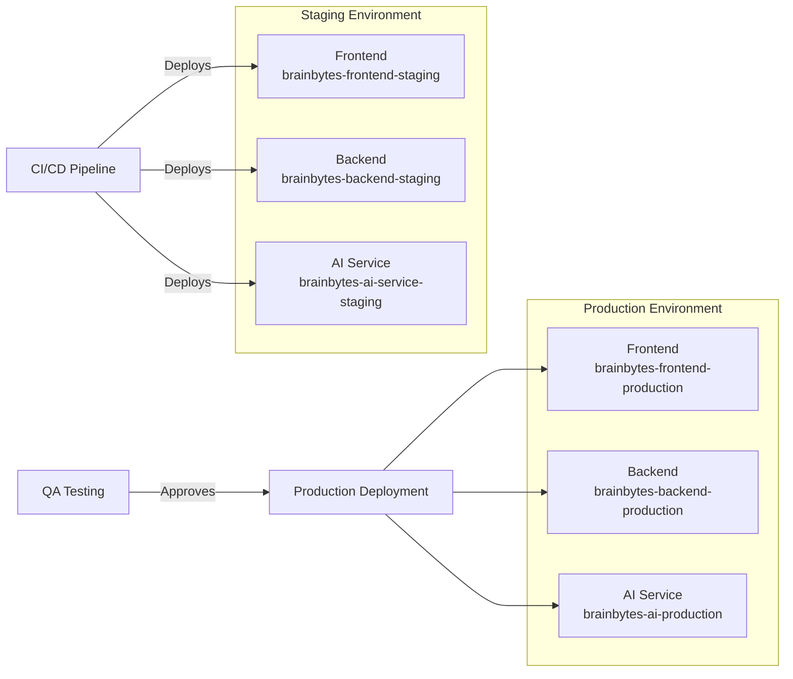
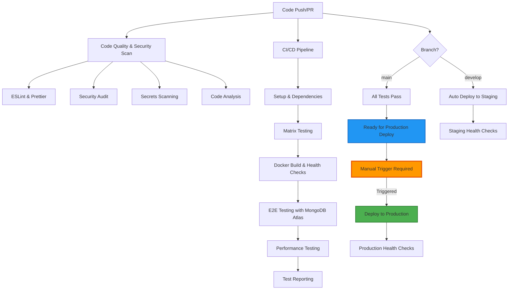
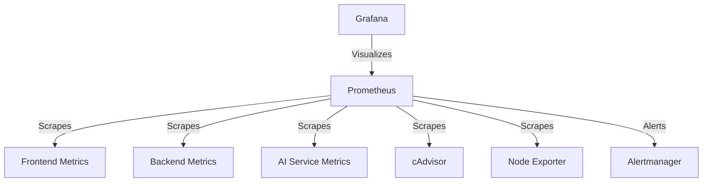

# BrainBytesAI System Architecture Document
## Complete Containerized Architecture (Updated July 2025)

**Document Version**: 2.0  
**Date**: July 2025  
**Author**: BrainBytesAI Development Team

---

## Executive Summary

BrainBytesAI is a production-ready, containerized AI-powered educational platform designed specifically for Filipino students. The system demonstrates enterprise-level DevOps practices with comprehensive monitoring, automated deployment, and operational excellence.

---

## Containerized Architecture Diagram

---

## Component Interactions

### Core Services
1. **Frontend Service** (Next.js)
   - Containerized with Docker
   - Port 3000 exposed
   - 1GB memory limit
   - Depends on backend service

2. **Backend Service** (Node.js/Express)
   - Containerized with Docker
   - Port 3000 exposed
   - 1GB memory limit
   - Connects to MongoDB Atlas and Redis
   - Depends on AI service

3. **AI Service** (Node.js)
   - Containerized with Docker
   - Port 3002 exposed
   - 2GB memory limit
   - Integrates with Groq API

4. **Nginx Reverse Proxy**
   - Routes traffic to all services
   - Handles ports 80/8080
   - Load balances between containers

---

## Cloud Deployment Configuration

### Heroku Platform Architecture

### Deployment Features:
- Automated deployments via GitHub Actions
- Environment-specific configuration
- Health verification checks
- Rollback capabilities

---

## CI/CD Pipeline Structure

### Pipeline Stages:
1. **Code Quality Checks**
   - ESLint, Prettier
   - Security scans
   - Dependency audits

2. **Testing Matrix**
   - Unit tests across Node.js versions
   - Integration tests
   - Coverage reporting

3. **Docker Validation**
   - Image builds
   - Container health checks

4. **E2E Testing**
   - Playwright tests
   - MongoDB Atlas integration

5. **Performance Testing**
   - Artillery load tests
   - Response time metrics

6. **Deployment**
   - Staging deployment (automatic)
   - Production deployment (manual approval)

---

## Monitoring Architecture

### Containerized Monitoring Stack

### Key Metrics:
- Container resource usage
- API response times
- Error rates
- User engagement
- AI processing performance

---

## Security Architecture

### Layers:
1. **Network Security**
   - HTTPS enforcement
   - CORS configuration
   - Rate limiting via Nginx

2. **Application Security**
   - Input validation
   - JWT authentication
   - Role-based access

3. **Container Security**
   - Resource limits
   - Read-only filesystems
   - Non-root users

---

## Performance Optimization

### Strategies:
1. **Frontend**
   - Server-side rendering
   - Code splitting
   - CDN caching

2. **Backend**
   - Redis caching
   - Connection pooling
   - Async processing

3. **Infrastructure**
   - Load balancing
   - Auto-scaling
   - Container optimization

---

## Technology Stack

### Core Technologies:
- **Frontend**: Next.js, React, Tailwind CSS
- **Backend**: Node.js, Express, MongoDB
- **AI Service**: Node.js, Groq API
- **Containerization**: Docker, Docker Compose
- **CI/CD**: GitHub Actions
- **Monitoring**: Prometheus, Grafana, Alertmanager
- **Deployment**: Heroku

---

## Conclusion

This architecture provides:
- Fully containerized microservices
- Comprehensive CI/CD automation
- Production-grade monitoring
- Scalable cloud deployment
- Security best practices
- Optimized performance

The system is designed for high availability while maintaining excellent performance for Filipino students.
