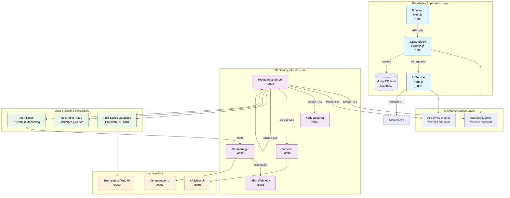

# System Architecture Documentation
## Task 2.1: Prometheus Integration with BrainBytes AI

### 🏗️ **Overall Architecture Diagram**



### 📊 **Data Flow Explanation**

#### **1. Metrics Generation**
- **Backend Service**: Collects HTTP requests, database operations, user sessions
- **AI Service**: Tracks AI response times, token usage, queue sizes
- **System Components**: Node Exporter and cAdvisor provide infrastructure metrics

#### **2. Metrics Collection (Scraping)**
```
Prometheus Server (15-second intervals)
├── Backend API (:3000/metrics) → Application metrics
├── AI Service (:3002/metrics) → AI-specific metrics  
├── Node Exporter (:9100) → Host system metrics
├── cAdvisor (:8080) → Container metrics
└── Self-monitoring (:9090) → Prometheus metrics
```

#### **3. Data Processing**
- **Raw Metrics** → Stored in Prometheus TSDB
- **Recording Rules** → Pre-calculated queries for performance
- **Alert Rules** → Threshold-based monitoring

#### **4. Alerting Pipeline**
```
Alert Rules → Alertmanager → Webhook → Notification
```

---

### 🔧 **Component Details**

#### **Prometheus Server (:9090)**
- **Purpose**: Central metrics collection and storage
- **Configuration**: Enhanced `prometheus.yml` with recording rules
- **Storage**: Time-series database with 15-day retention
- **Scrape Targets**: 5 endpoints monitored

#### **Alertmanager (:9093)**
- **Purpose**: Alert routing and deduplication
- **Configuration**: `alertmanager.yml` with webhook routing
- **Features**: Grouping, silencing, inhibition rules

#### **Node Exporter (:9100)**
- **Purpose**: Host system metrics
- **Metrics**: CPU, memory, disk, network usage
- **Deployment**: Privileged container with host access

#### **cAdvisor (:8080)**
- **Purpose**: Container resource monitoring
- **Metrics**: Per-container CPU, memory, I/O usage
- **Integration**: Docker socket access for container stats

#### **Alert Webhook (:5001)**
- **Purpose**: Development alert dashboard
- **Features**: Real-time alert display, webhook testing
- **Integration**: Receives alerts from Alertmanager

---

### 🚀 **Enhanced Features**

#### **Recording Rules Implementation**
- **Purpose**: Optimize frequently used queries
- **Benefits**: Faster dashboard loading, reduced computation
- **Examples**: Request rates, error rates, percentiles

#### **Filipino Context Adaptations**
- **Mobile Metrics**: Android/iOS usage tracking
- **Data Usage**: Response size monitoring for cost optimization
- **Connectivity**: Connection drop detection for intermittent networks

#### **Multi-Environment Support**
- **Development**: Full monitoring stack with Docker Compose
- **Staging**: Enhanced configuration for testing
- **Production**: Heroku-compatible with external Prometheus

---

### 📈 **Metrics Categories**

#### **Application Performance Metrics**
```
brainbytes_http_request_duration_seconds (Histogram)
brainbytes_http_requests_total (Counter)
brainbytes_active_sessions (Gauge)
```

#### **AI Service Metrics**
```
brainbytes_ai_request_duration_seconds (Histogram)
brainbytes_ai_requests_total (Counter)
brainbytes_ai_queue_size (Gauge)
brainbytes_ai_tokens_used_total (Counter)
```

#### **Business Intelligence Metrics**
```
brainbytes_tutoring_sessions_total (Counter)
brainbytes_questions_total (Counter)
brainbytes_user_session_duration_seconds (Histogram)
```

#### **Filipino Context Metrics**
```
brainbytes_mobile_requests_total (Counter)
brainbytes_response_size_bytes (Histogram)
brainbytes_connection_drops_total (Counter)
```

---

### 🔄 **Data Retention & Storage**

#### **Storage Configuration**
- **Retention Period**: 15 days (configurable)
- **Storage Path**: `/prometheus` (persistent volume)
- **Compression**: Enabled for efficiency

#### **Performance Optimization**
- **Scrape Intervals**: 15 seconds for apps, 30 seconds for infrastructure
- **Recording Rules**: Pre-calculated aggregations
- **Query Optimization**: Indexed time-series storage

---

### 🌐 **Network Architecture**

#### **Docker Networks**
```
app-network: Frontend ↔ Backend ↔ AI Service
monitoring-network: Prometheus ↔ Exporters ↔ Alertmanager
```

#### **Port Mapping**
```
Application Ports:
- Frontend: 3000 (direct)
- Backend: 3000/metrics
- AI Service: 8090/metrics

Monitoring Ports:
- Prometheus: 9090
- Alertmanager: 9093
- Node Exporter: 9100
- cAdvisor: 8081
```

---

### 🔐 **Security Considerations**

#### **Access Control**
- **Internal Networks**: Services communicate via Docker networks
- **External Access**: Only web UIs exposed to host
- **Metrics Endpoints**: No authentication (internal only)

#### **Data Privacy**
- **No Sensitive Data**: Metrics contain only aggregated statistics
- **Label Safety**: User identifiers excluded from metrics
- **Retention Limits**: Automatic data expiration

This architecture provides comprehensive monitoring while maintaining security and performance for the BrainBytes AI tutoring platform, with special considerations for Filipino users' mobile and connectivity patterns.